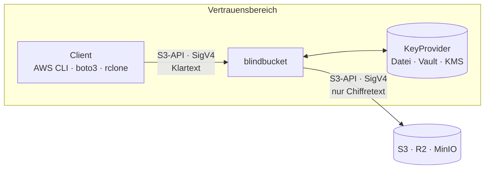
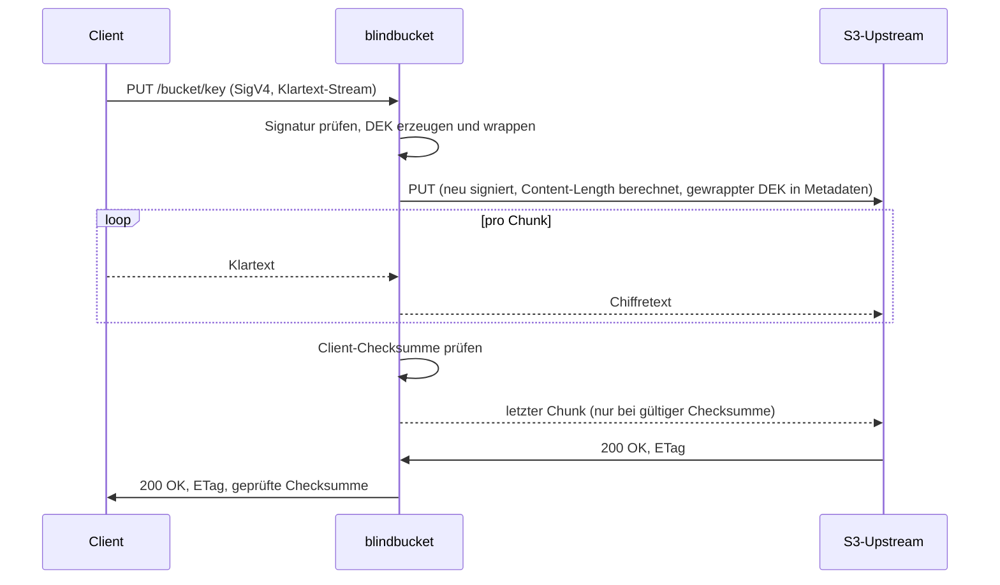
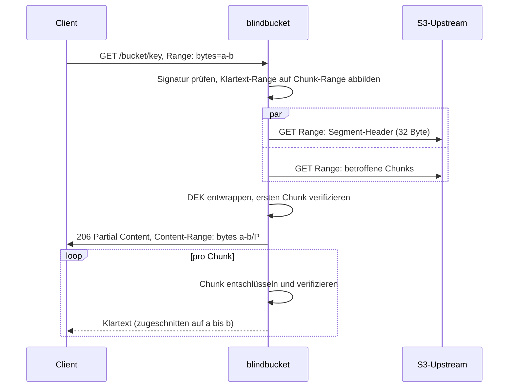
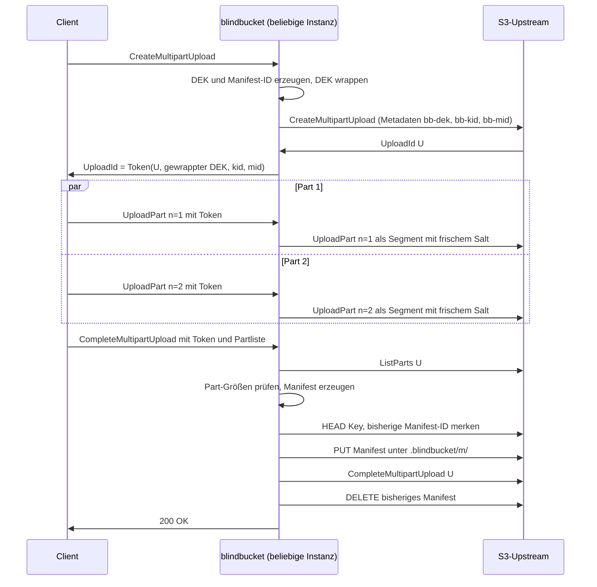

# blindbucket – Projektkonzept

> **Ein transparentes S3-Verschlüsselungs-Gateway in Go.**
> Clients sprechen ganz normal S3. Der Cloud-Speicher sieht ausschließlich Chiffretext – nie Klartext, nie Schlüssel.

| | |
|---|---|
| **Status** | Konzept, vor M0 |
| **Dokumentversion** | 0.2 (September 2026) |
| **Änderungen in 0.2** | Race Conditions im Manifest-Lebenszyklus behoben (10.6, 10.8, 11); Sprachen und Werkzeuge außerhalb des Go-Kerns (15.2); formales Modell als Meilenstein M3.5 |
| **Sprache** | Go (aktuelle stabile Version, mindestens 1.24 wegen `crypto/hkdf`) |
| **Lizenz (geplant)** | Apache 2.0 |

---

## Inhalt

1. [Kurzfassung](#1-kurzfassung)
2. [Problem und Motivation](#2-problem-und-motivation)
3. [Ziele und Nicht-Ziele](#3-ziele-und-nicht-ziele)
4. [Abgrenzung zu bestehenden Lösungen](#4-abgrenzung-zu-bestehenden-lösungen)
5. [Einsatzszenarien](#5-einsatzszenarien)
6. [Architekturüberblick](#6-architekturüberblick)
7. [Bedrohungsmodell](#7-bedrohungsmodell)
8. [Kryptografisches Design](#8-kryptografisches-design)
9. [S3-Schicht](#9-s3-schicht)
10. [Multipart-Uploads](#10-multipart-uploads)
11. [Kopieren und Schlüsselrotation](#11-kopieren-und-schlüsselrotation)
12. [Leistungs- und Speichermodell](#12-leistungs--und-speichermodell)
13. [Konfiguration und CLI](#13-konfiguration-und-cli)
14. [Projektstruktur und Go-APIs](#14-projektstruktur-und-go-apis)
15. [Technologie-Stack und Sprachen](#15-technologie-stack-und-sprachen)
16. [Qualitätssicherung](#16-qualitätssicherung)
17. [Betrieb und Observability](#17-betrieb-und-observability)
18. [Meilensteine](#18-meilensteine)
19. [Priorisierung bei Zeitmangel](#19-priorisierung-bei-zeitmangel)
20. [Präsentation im Portfolio](#20-präsentation-im-portfolio)
21. [Risiken und offene Fragen](#21-risiken-und-offene-fragen)
22. [ADR-Backlog](#22-adr-backlog)
23. [Glossar](#23-glossar)
24. [Referenzen](#24-referenzen)

---

## 1. Kurzfassung

blindbucket ist ein Reverse-Proxy, der die S3-API spricht. Er sitzt zwischen beliebigen S3-Clients (AWS CLI, boto3, rclone, MinIO Client, eigene Backends) und einem S3-kompatiblen Speicher (AWS S3, Cloudflare R2, MinIO, Backblaze B2 …). Uploads werden im Datenstrom verschlüsselt, Downloads im Datenstrom entschlüsselt. Für den Client ändert sich nur der Endpoint.

Der Kern des Projekts ist nicht „AES um S3 wickeln“, sondern die saubere Lösung der Probleme, die dabei entstehen: authentisierte Verschlüsselung für Objekte bis 5 TiB bei konstantem Speicherbedarf, Range-Requests auf Chiffretext, parallele Multipart-Uploads über mehrere zustandslose Instanzen, SigV4 in beide Richtungen und die Checksum-Mechanismen moderner SDKs.

| Eigenschaft | Umsetzung |
|---|---|
| Vertraulichkeit | AES-256-GCM, eigener Datenschlüssel pro Objekt |
| Integrität | Chunkweise authentisiert; Manipulation, Abschneiden, Umsortieren und Vertauschen werden erkannt |
| Konstanter Speicher | O(Chunkgröße) pro aktivem Stream, unabhängig von der Objektgröße |
| Zustandslosigkeit | Kein lokaler Zustand; Multipart-Zustand reist in einem verschlüsselten Token mit |
| Drop-in-Kompatibilität | Standard-Clients ohne Codeänderung, nur `--endpoint-url` |
| Schlüsselrotation | KEK-Rotation per serverseitigem Copy, ohne erneute Datenübertragung |

---

## 2. Problem und Motivation

Backups, Logs, Datenbank-Dumps und Dokumente landen heute fast immer in S3-kompatiblem Objektspeicher. Die serverseitige Verschlüsselung der Anbieter (SSE-S3, SSE-KMS) schützt gegen gestohlene Festplatten im Rechenzentrum, aber nicht gegen den Anbieter selbst: Er verwaltet die Schlüssel und sieht bei jedem Request den Klartext. Für Unternehmen mit Compliance-Anforderungen, für Daten in fremden Jurisdiktionen oder schlicht aus Prinzip reicht das nicht.

Clientseitige Verschlüsselung löst das Vertrauensproblem, verschiebt aber die Last in jede einzelne Anwendung. Bibliotheken wie der AWS S3 Encryption Client sind sprachgebunden, müssen in jedes Backend eingebaut und konsistent konfiguriert werden, und Werkzeuge wie die AWS CLI oder Datenbank-Backup-Tools unterstützen sie gar nicht.

Ein Gateway zentralisiert die Verschlüsselung an genau einer Stelle im eigenen Vertrauensbereich. Anwendungen bleiben unverändert, die Schlüsselverwaltung ist an einem Ort, und das Sicherheitsniveau hängt nicht davon ab, ob jedes Team die Bibliothek richtig benutzt.

Die Schwierigkeit liegt in den Details: Objekte können Gigabytes groß sein, Clients lesen gezielt Byte-Bereiche, laden parallel in Teilen hoch, wiederholen fehlgeschlagene Requests und prüfen Checksummen. Jede dieser Eigenschaften kollidiert auf eine eigene Weise mit authentisierter Verschlüsselung. Genau diese Kollisionen sauber aufzulösen ist der eigentliche Inhalt dieses Projekts.

---

## 3. Ziele und Nicht-Ziele

### Ziele

| ID | Ziel | Messbares Kriterium |
|---|---|---|
| G1 | Vertraulichkeit der Objektinhalte gegenüber dem Speicheranbieter | Im Upstream liegen nur Daten im blindbucket-Format; Klartext und Schlüssel verlassen den Vertrauensbereich nie |
| G2 | Integrität | Jede Manipulation am Inhalt führt zu einem Fehler, niemals zu falschem Klartext |
| G3 | Konstanter Speicherbedarf | Peak-RSS beim Up- und Download von 10 GiB unter 50 MiB (Proxy) bzw. unter 20 MiB (CLI) |
| G4 | S3-Kompatibilität | AWS CLI und boto3 bestehen die Integrationssuite inklusive Range und Multipart; rclone und `mc` dokumentiert |
| G5 | Horizontale Skalierung | Multipart-Upload über zwei Instanzen hinter Round-Robin ohne Sticky Sessions |
| G6 | Rotation ohne Re-Upload | KEK-Wechsel für einen Präfix ausschließlich über serverseitige Copy-Operationen |
| G7 | Nachvollziehbarkeit | Formatspezifikation mit Testvektoren, Threat Model, reproduzierbare Benchmarks im Repo |

### Nicht-Ziele

Bewusst nicht Teil des Projekts (zumindest nicht vor M6):

- **Verbergen von Metadaten.** Objektnamen, Größen, Zeitstempel und Zugriffsmuster bleiben für den Anbieter sichtbar. Namensverschlüsselung ist ein Stretch-Ziel.
- **Schutz vor einem kompromittierten Proxy-Host.** Wer den Host oder den KEK kontrolliert, hat alles.
- **Eigene Speicherschicht oder vollständige S3-Emulation.** Bucket Policies, IAM, Object Lock, Replikation und Lifecycle-Regeln bleiben Sache des Anbieters.
- **Kompression und Deduplizierung.** Kompression vor der Verschlüsselung macht die Chiffretextlänge vom Inhalt abhängig und öffnet Seitenkanäle (vgl. CRIME/BREACH). Deduplizierung über Objekte hinweg widerspricht zufälligen Schlüsseln pro Objekt.
- **Verfügbarkeit.** Der Anbieter kann Daten löschen oder den Zugriff verweigern; das erkennt blindbucket, verhindert es aber nicht.

---

## 4. Abgrenzung zu bestehenden Lösungen

Das Problem ist nicht neu. Das Repo muss daher klar sagen, was es anders macht.

| Lösung | Ansatz | Unterschied zu blindbucket |
|---|---|---|
| SSE-S3 / SSE-KMS | Anbieter verschlüsselt serverseitig | Anbieter hält Schlüssel und sieht Klartext |
| SSE-C | Client liefert Schlüssel pro Request, Anbieter verschlüsselt | Schlüssel und Klartext gehen bei jedem Request an den Anbieter |
| MinIO mit KES | Serverseitige Verschlüsselung im selbst betriebenen Speicher | Schützt nur, wenn Speicherbetreiber und Nutzer identisch sind |
| AWS S3 Encryption Client | Clientseitige Bibliothek | Muss in jede Anwendung eingebaut werden, sprachgebunden, nicht für CLI-Tools |
| rclone crypt | Verschlüsselung im rclone-Client, optional über `rclone serve s3` als Endpoint | Fokus auf Einzelnutzer und Sync; kein zustandsloses Mehrinstanz-Gateway mit KMS-Hierarchie und dokumentiertem Range-/Multipart-Mapping |
| s3proxy (gaul) | Allgemeiner S3-Proxy mit optionaler Verschlüsselungs-Middleware | Verschlüsselung ist Zusatzfunktion eines Allzweck-Proxys, nicht das Kerndesign |
| Cryptomator, gocryptfs | Verschlüsselung auf Dateisystemebene | Kein S3-Endpoint |

**Positionierung:** blindbucket ist ein spezialisiertes, zustandsloses Gateway mit offen spezifiziertem Format, das mit Standard-Clients inklusive Range- und parallelen Multipart-Uploads funktioniert, bei nachgewiesen konstantem Speicherbedarf.

---

## 5. Einsatzszenarien

| Modell | Beschreibung | Vertrauensgrenze | Anforderung |
|---|---|---|---|
| **Sidecar** | Eine Instanz pro Anwendung, z. B. im selben Kubernetes-Pod, lauscht auf `localhost` | Pod bzw. Host | Klartext verlässt den Host nie; TLS zum Client optional |
| **Zentrales Gateway** | Mehrere Instanzen hinter einem Loadbalancer für viele Anwendungen | Internes Netz | TLS zwischen Client und Proxy ist Pflicht, weil SigV4 den Body nicht verschlüsselt |
| **Entwickler-Gateway** | `blindbucket serve` lokal, davor rclone, AWS CLI oder ein Backup-Tool | Laptop | Datei-Keyring mit Passphrase |

In allen Modellen gilt: Zwischen Client und Proxy fließt Klartext. Der Proxy muss deshalb im selben Vertrauensbereich wie der Client stehen.

---

## 6. Architekturüberblick



### Komponenten

| Komponente | Verantwortung |
|---|---|
| `s3api` | HTTP-Routing nach S3-Semantik (Pfad, Host, Query-Parameter), XML-Ein- und -Ausgabe, S3-konforme Fehler |
| `auth` | SigV4-Verifikation eingehender Requests, `aws-chunked`-Decoding, Checksum-Prüfung |
| `proxy` | Handler pro Operation, Range-Mapping, Metadaten-Übersetzung, Upload-Token |
| `crypto/stream` | Segmentformat: Verschlüsselung und Entschlüsselung als `io.Writer` / `io.Reader` |
| `crypto/keys` | DEK-Erzeugung, Wrapping, Keyring, `KeyProvider`-Implementierungen |
| `manifest` | Erzeugung und Prüfung der Multipart-Manifeste |
| `upstream` | Schlanker, signierender S3-Client auf Basis von `net/http` |
| `obs` | Metriken, strukturiertes Logging mit Redaction, Health-Checks, pprof |

Die Krypto-Pakete haben keinerlei Abhängigkeit zu HTTP oder S3. Sie sind isoliert testbar und könnten als eigenständige Bibliothek genutzt werden.

### Ablauf eines Uploads (PutObject)



### Ablauf eines Range-Downloads (GetObject mit Range)



---
## 7. Bedrohungsmodell

Dieses Kapitel ist die Grundlage für `docs/THREAT_MODEL.md`. Es sagt präzise, was blindbucket garantiert und was nicht. Ein ehrliches Threat Model ist glaubwürdiger als ein Buzzword im Projekttitel; aus demselben Grund verwendet dieses Projekt den Begriff „Zero Trust“ nicht (der bezeichnet eine Zugriffsarchitektur nach NIST SP 800-207, nicht Verschlüsselung).

### 7.1 Schutzgüter

- **Objektinhalte** (Klartext der gespeicherten Daten)
- **Schlüsselmaterial** (Root-Key, KEKs, DEKs, Token-Schlüssel)
- **Client-Credentials** für den Proxy und Upstream-Credentials für den Speicher

### 7.2 Akteure

| ID | Akteur | Fähigkeiten | Im Scope |
|---|---|---|---|
| A1 | Speicheranbieter, passiv | Liest alles, was gespeichert oder an ihn übertragen wird | Ja |
| A2 | Speicheranbieter, aktiv | Verändert, kürzt, vertauscht, löscht Objekte und Metadaten; spielt alte Daten ein; lügt in Listings und Response-Headern | Ja, mit Einschränkungen (7.5) |
| A3 | Netzwerkangreifer zwischen Proxy und Anbieter | Wie A1/A2 auf dem Übertragungsweg | Ja (TLS; reduziert sich auf A1/A2) |
| A4 | Unberechtigter Client | Sendet Requests an den Proxy ohne gültige Credentials oder mit Credentials für andere Buckets | Ja |
| A5 | Angreifer auf dem Proxy-Host oder mit Zugriff auf KEK/Root-Key | Liest Speicher, Konfiguration, Schlüssel | Nein |
| A6 | Netzwerkangreifer zwischen Client und Proxy | Liest und verändert Klartext-Requests | Nur durch TLS bzw. Sidecar-Betrieb abgedeckt |

### 7.3 Garantien

| Eigenschaft | Garantiert | Mechanismus |
|---|---|---|
| Vertraulichkeit des Inhalts | Ja | AES-256-GCM; Schlüssel verlassen den Vertrauensbereich nie im Klartext |
| Integrität einzelner Chunks | Ja | GCM-Tag pro Chunk |
| Reihenfolge der Chunks | Ja | Chunk-Zähler im Nonce |
| Erkennung von Abschneiden | Ja | Final-Flag im Nonce; bei Multipart zusätzlich das Manifest |
| Bindung von Inhalt an Bucket und Key | Ja | Bucket und Key als Associated Data beim DEK-Wrapping |
| Erkennung vertauschter oder fehlender Parts | Ja | Part-Nummer im authentisierten Segment-Header, MAC-geschütztes Manifest |
| Authentisierung der Clients | Ja | SigV4 mit proxy-eigenen Credentials, konstantzeitiger Vergleich |
| Schutz vor Rollback auf ältere Version desselben Keys | **Nein** | Restrisiko, siehe 7.5 |
| Vertraulichkeit von Namen, Größen, Zeitpunkten | **Nein** | Siehe 7.4 |
| Authentizität von Größenangaben im Listing | **Nein** | Aus unauthentisierten Upstream-Daten berechnet |
| Verfügbarkeit | **Nein** | Anbieter kann löschen oder blockieren |

### 7.4 Was der Anbieter weiterhin sieht

- Bucket-Namen und Objekt-Keys im Klartext
- Die **exakte** Klartextgröße: Das Format ist deterministisch, die Größe ist aus der Chiffretextgröße berechenbar (Abschnitt 8.5)
- `Content-Type`, `Cache-Control` und benutzerdefinierte Metadaten des Clients
- Zeitpunkte von Uploads, Downloads und Löschungen
- Zugriffsmuster: welche Objekte, welche Byte-Bereiche, in welcher Frequenz
- Bei Multipart-Objekten die Anzahl der Parts
- Die ID des verwendeten KEK (nicht den KEK selbst)

### 7.5 Restrisiken und bewusste Entscheidungen

**Rollback.** Liefert der Anbieter eine ältere, echte Version desselben Objekts aus (etwa aus seinem Versioning), ist diese kryptografisch gültig: Sie wurde vom Proxy selbst erzeugt und ist an denselben Bucket und Key gebunden. Ohne externen, authentisierten Index (z. B. Versionszähler in einer vertrauenswürdigen Datenbank) ist das nicht erkennbar. Mitigation ist ein Stretch-Ziel.

**Retry-Substitution bei Multipart.** Innerhalb eines Uploads könnte ein aktiver Anbieter einen Part gegen einen früheren Übertragungsversuch derselben Part-Nummer tauschen. Beide Versuche sind gültige, vom Proxy erzeugte Segmente. Da Clients bei Retries denselben Inhalt senden, ist das praktisch meist folgenlos. Mitigation (M6): ETags der Parts ins Manifest aufnehmen und beim vollständigen GET pro Part den MD5 des Chiffretexts prüfen.

**Teilweise ausgelieferter Klartext.** Wird beim Download nach dem Senden des Status 200 ein manipulierter Chunk erkannt, bricht der Proxy die Verbindung ab. Der Client hat zu diesem Zeitpunkt bereits authentischen Klartext der vorherigen Chunks erhalten, erkennt wegen des gesetzten `Content-Length` aber einen unvollständigen Download. Clients, die Short Reads ignorieren, würden eine unvollständige Datei behalten; das ist ein Clientfehler.

**Schlüsselmaterial im Speicher.** Go garantiert kein zuverlässiges Überschreiben von Speicher (der Garbage Collector kann Daten kopieren). Der Proxy-Host muss daher vertrauenswürdig sein; empfohlen sind deaktivierter Swap oder verschlüsselter Swap und deaktivierte Core-Dumps.

**DEK-Kompromittierung.** Rotation tauscht den KEK, nicht den DEK. Ist ein DEK kompromittiert, hilft nur Neuverschlüsselung des betroffenen Objekts.

**Seitenkanäle auf dem Host.** Timing- und Cache-Angriffe auf dem Proxy-Host sind außerhalb des Scopes. AES-GCM nutzt in Go auf gängigen Plattformen Hardware-Beschleunigung (AES-NI, ARMv8 Crypto Extensions) mit konstanter Laufzeit; Signaturvergleiche erfolgen mit `hmac.Equal`.

---

## 8. Kryptografisches Design

### 8.1 Primitive

| Zweck | Primitive | Go-Paket |
|---|---|---|
| Inhaltsverschlüsselung | AES-256-GCM | `crypto/aes`, `crypto/cipher` |
| Schlüsselableitung | HKDF-SHA256 (RFC 5869) | `crypto/hkdf` |
| DEK-Wrapping (lokal) | AES-256-GCM | `crypto/cipher` |
| Manifest-Authentisierung | HMAC-SHA256 | `crypto/hmac`, `crypto/sha256` |
| Zufall | CSPRNG des Betriebssystems | `crypto/rand` |
| Request-Signaturen | SigV4 (HMAC-SHA256) | eigene Verifikation; `aws-sdk-go-v2/aws/signer/v4` für Upstream |
| Keyring-Schutz per Passphrase | Argon2id | `golang.org/x/crypto/argon2` |

Der Krypto-Kern nutzt ausschließlich die Standardbibliothek. Es gibt keine selbst erfundenen Primitive, nur eine etablierte Konstruktion (STREAM) aus etablierten Bausteinen.

### 8.2 Warum nicht einfach AES-GCM über das ganze Objekt

Gos `cipher.AEAD` arbeitet mit vollständigen Byte-Slices: `Seal` und `Open` brauchen die gesamte Nachricht im Speicher. Das allein widerspricht G3. Zusätzlich:

- GCM erlaubt pro Nachricht höchstens 2³⁹ − 256 Bit Klartext, also rund 64 GiB. S3-Objekte können 5 TiB groß sein.
- Selbst eine manuell gestreamte GCM-Implementierung dürfte Klartext erst nach der Tag-Prüfung am Ende herausgeben. Wer vorher Daten ausliefert, liefert unauthentisierten Klartext und bricht die AEAD-Garantie.
- Range-Requests wären unmöglich, weil der Tag nur über die gesamte Nachricht geprüft werden kann.

Die Lösung ist **Online Authenticated Encryption** nach der STREAM-Konstruktion (Hoang, Reyhanitabar, Rogaway, Vizár, CRYPTO 2015), die auch `age` und Googles Tink (Streaming AEAD) verwenden: Der Datenstrom wird in Chunks fester Größe zerlegt, jeder Chunk wird einzeln mit AEAD versiegelt, und der Nonce kodiert die Position sowie die Information, ob es der letzte Chunk ist.

### 8.3 Schlüsselhierarchie

```
Root-Key            AWS KMS · Vault Transit · Passphrase (Argon2id)
 └─ KEK             32 Byte, mehrere Versionen im Keyring, jede mit ID (z. B. "2026-09")
     ├─ Token-Key   = HKDF-SHA256(KEK, salt="", info="blindbucket/v1/upload-token")
     └─ DEK         32 Byte zufällig, einer pro Objekt bzw. pro Multipart-Upload
         ├─ Segment-Subkey  = HKDF-SHA256(DEK, salt=Segment-Salt, info="blindbucket/v1/segment")
         └─ Manifest-Key    = HKDF-SHA256(DEK, salt="",          info="blindbucket/v1/manifest")
```

**Warum drei Ebenen?** Ein KMS-Aufruf pro Objekt kostet Latenz (Netzwerk-Roundtrip) und Geld. Stattdessen wird der Keyring mit den KEKs beim Start einmal über KMS oder Vault entschlüsselt und im Speicher gehalten; das Wrappen der DEKs geschieht lokal. Wird der Root-Key rotiert, muss nur der Keyring neu verpackt werden. Wird ein KEK rotiert, werden nur die DEK-Wraps in den Objektmetadaten erneuert (Abschnitt 11).

**DEK-Wrapping:**

```
WrappedDEK = Nonce(12) || AES-256-GCM.Seal(KEK[kid], Nonce, DEK, AAD)        → 60 Byte
AAD        = "blindbucket/v1/dek" || lp(kid) || lp(bucket) || lp(key)
lp(x)      = uint16_be(len(x)) || x
```

Die Längenpräfixe verhindern Mehrdeutigkeiten (sonst wären `bucket="ab", key="c"` und `bucket="a", key="bc"` dasselbe AAD). Weil Bucket und Key im AAD stehen, schlägt das Entwrappen fehl, wenn der Anbieter zwei Objekte samt Metadaten vertauscht.

**Metadaten am Upstream-Objekt:**

| Header | Inhalt | Größe |
|---|---|---|
| `x-amz-meta-bb-v` | Formatversion | `1` |
| `x-amz-meta-bb-kid` | KEK-ID | wenige Byte |
| `x-amz-meta-bb-dek` | gewrappter DEK, base64url | 80 Zeichen |
| `x-amz-meta-bb-mid` | Manifest-ID (nur Multipart), 16 Byte base64url | 22 Zeichen |

Diese Header werden in Responses an den Client entfernt. Schreibversuche von Clients mit Metadaten-Präfix `bb-` werden abgelehnt. S3 begrenzt benutzerdefinierte Metadaten auf 2 KB; blindbucket belegt davon rund 150 Byte, was dokumentiert wird.

### 8.4 Segmentformat

Ein **Segment** ist die Einheit, die einen Klartext-Datenstrom unter einem Subkey verschlüsselt. Ein Single-Part-Objekt besteht aus genau einem Segment, ein Multipart-Objekt aus einem Segment pro Part.

```
Segment = Header(32) || Chunk_0 || Chunk_1 || … || Chunk_(N−1)
```

**Header (32 Byte):**

| Offset | Länge | Feld | Wert |
|---|---|---|---|
| 0 | 4 | Magic | `"BLBK"` |
| 4 | 1 | Version | `0x01` |
| 5 | 1 | log₂(Chunkgröße) | Default `16`; erlaubt `12` bis `20` |
| 6 | 1 | Flags | Bit 0: Segment gehört zu Multipart-Objekt; übrige Bits `0` |
| 7 | 1 | Reserviert | `0x00` |
| 8 | 4 | Segment-Index | `uint32_be`; `0` bei Single-Part, sonst Part-Nummer (1–10000) |
| 12 | 20 | Salt | zufällig, pro Segment neu |

**Chunks:**

```
C        = 2^log2C
Subkey   = HKDF-SHA256(secret=DEK, salt=Salt, info="blindbucket/v1/segment", L=32)
Nonce_i  = uint88_be(i) || f_i          f_i = 0x01 für den letzten Chunk, sonst 0x00   → 12 Byte
Chunk_i  = AES-256-GCM.Seal(Subkey, Nonce_i, Klartext_i, AAD=Header)                    → |Klartext_i| + 16 Byte
```

**Regeln für Encoder und Decoder:**

1. Jeder Chunk außer dem letzten enthält genau C Byte Klartext.
2. Der letzte Chunk enthält 1 bis C Byte. Ein leerer Chunk ist nur erlaubt, wenn das gesamte Segment leer ist (dann ist er der einzige Chunk).
3. Nach dem Chunk mit `f = 1` dürfen keine weiteren Bytes folgen.
4. Der Decoder prüft `log2C`, Version, Flags und das reservierte Byte, **bevor** er Puffer allokiert. Der Header ist erst nach der erfolgreichen Prüfung des ersten Chunks authentisiert; ohne diese Vorabprüfung könnte ein manipulierter Header mit `log2C = 30` eine Allokation von 1 GiB erzwingen.
5. Der Decoder gibt Klartext eines Chunks erst heraus, wenn dessen Tag vollständig geprüft ist.

**Lookahead:** Der Encoder weiß bei einem vollen Puffer nicht, ob noch Daten folgen. Er hält daher den jeweils letzten vollen Chunk zurück, bis entweder weitere Bytes kommen oder `Close` aufgerufen wird. Der Decoder liest `C + 16` Byte und schaut per `bufio.Reader.Peek(1)` ein Byte voraus, um zu entscheiden, ob `f = 0` oder `f = 1` gelten muss. Dieses Zurückhalten des letzten Chunks ist auch der Hebel für die Checksum-Prüfung beim Upload (Abschnitt 9.3).

**Warum die Nonce-Konstruktion sicher ist:** Innerhalb eines Segments ist `i` eindeutig. Über Segmente hinweg ist der Subkey verschieden, weil jedes Segment einen neuen 160-Bit-Salt erhält; eine Kollision ist nach dem Geburtstagsparadoxon erst nach etwa 2⁸⁰ Segmenten zu erwarten. Ein (Schlüssel, Nonce)-Paar wird also nie wiederverwendet. Der 88-Bit-Zähler reicht weit über die 5 TiB eines S3-Objekts hinaus (das sind bei 64 KiB nur 2²⁶ Chunks). Frische Subkeys pro Segment halten außerdem die Datenmenge unter einem einzelnen GCM-Schlüssel klein.

**Was der Header im AAD bewirkt:** Chunkgröße, Multipart-Flag und Segment-Index sind mit jedem Chunk authentisiert. Ein Anbieter kann weder die Chunkgröße umdeuten noch ein Multipart-Objekt als Single-Part-Objekt ausgeben noch Parts umsortieren, ohne dass die Prüfung fehlschlägt.

**Warum 64 KiB?** Der Overhead beträgt 16/65 536 ≈ 0,024 %. Range-Requests lesen höchstens 64 KiB zu viel. Der Puffer pro Stream bleibt klein. Und alle üblichen Part-Größen von S3-Clients (5, 8, 16 MiB) sind Vielfache von 64 KiB, was die Größenarithmetik bei Multipart-Objekten ermöglicht (Abschnitt 10.5).

### 8.5 Größenarithmetik

Für ein Segment mit P Byte Klartext und Chunkgröße C:

```
N(P) = max(1, ⌈P / C⌉)
S(P) = 32 + P + 16 · N(P)
```

Die Umkehrung von Chiffretextgröße S auf Klartextgröße P:

```
N = ⌈(S − 32) / (C + 16)⌉
P = S − 32 − 16 · N
```

Gültig sind nur S ≥ 48, und `(S − 32) mod (C + 16)` darf nicht im Bereich 1 bis 16 liegen, mit Ausnahme von S = 48 (leeres Objekt). Ungültige Größen deuten auf Manipulation hin und führen zu einem Fehler.

**Beispiel:** P = 100 MiB = 104 857 600 Byte, C = 65 536 → N = 1600, S = 32 + 104 857 600 + 25 600 = 104 883 232. Rückrechnung: (S − 32) / 65 552 = 1600 → P = 104 883 200 − 25 600 = 104 857 600.

Die Arithmetik wird an drei Stellen gebraucht:

- **Upload:** `Content-Length` für den Upstream steht vor dem ersten Byte fest; es muss nichts gepuffert werden.
- **HEAD und Listing:** Klartextgrößen werden ohne zusätzliche Requests berechnet.
- **Range-Requests:** Klartext-Offsets lassen sich direkt auf Chiffretext-Offsets abbilden.

### 8.6 Range-Requests

Für ein Single-Part-Objekt und einen Klartext-Bereich `bytes=a-b` (inklusiv, 0 ≤ a ≤ b < P):

```
i       = ⌊a / C⌋                                   erster betroffener Chunk
j       = ⌊b / C⌋                                   letzter betroffener Chunk
c_start = 32 + i · (C + 16)
c_end   = min(32 + (j + 1) · (C + 16), S) − 1
skip    = a − i · C                                 zu verwerfende Bytes am Anfang
```

Der Proxy fordert beim Upstream parallel die Bytes `0–31` (Header) und `c_start–c_end` an. Ist `i = 0`, genügt ein einziger Request `0–c_end`. Er entschlüsselt die Chunks i bis j, wobei Chunk j das Final-Flag trägt, wenn `j = N − 1`. N ergibt sich aus der Gesamtgröße S, die der Upstream im `Content-Range`-Header meldet. Lügt der Anbieter dort, schlägt die Prüfung des Final-Flags fehl. Dann verwirft der Proxy `skip` Bytes und liefert `b − a + 1` Bytes.

**Beispiel:** 100-MiB-Objekt, `Range: bytes=1000000-1999999`.
i = 15, j = 30, c_start = 983 312, c_end = 2 032 143 (16 Chunks, 1 048 832 Byte Chiffretext). Der Proxy verwirft 16 960 Byte und liefert 1 000 000 Byte mit `206 Partial Content` und `Content-Range: bytes 1000000-1999999/104857600`.

**Sonderfälle:** Offene Bereiche (`bytes=a-`) werden als offener Upstream-Range angefragt. Suffix-Bereiche (`bytes=-n`) erfordern die Klartextgröße vorab und kosten deshalb einen zusätzlichen HEAD. Mehrfach-Ranges unterstützt S3 nicht, blindbucket daher auch nicht. Ranges auf Multipart-Objekten werden über das Manifest aufgelöst (Abschnitt 10.6).

### 8.7 Fehlerbehandlung: fail-closed

Grundsatz: **Kein Byte unauthentisierten Klartexts verlässt den Proxy.**

- **Vor dem Senden der Response-Header:** Der Proxy entwrappt den DEK und verifiziert den ersten Chunk, bevor er den Status schreibt. Falscher Schlüssel, manipulierte Metadaten und manipulierte Header werden so mit einer regulären S3-Fehlerantwort gemeldet.
- **Nach dem Senden der Header:** Status 200 und `Content-Length` sind raus. Schlägt die Prüfung eines späteren Chunks fehl, bricht der Handler per `panic(http.ErrAbortHandler)` ab. Bei HTTP/1.1 schließt der Server die Verbindung, bei HTTP/2 setzt er den Stream zurück. Der Client sieht einen unvollständigen Body statt einer scheinbar vollständigen Datei.
- Jeder Integritätsfehler wird als Metrik gezählt (`blindbucket_integrity_failures_total{kind}`) und mit Bucket, Key und Chunk-Index geloggt, ohne Schlüsselmaterial.

---
## 9. S3-Schicht

### 9.1 Adressierung

Ab M2 wird Path-Style unterstützt (`https://proxy/bucket/key`), ab M3 zusätzlich Virtual-Hosted-Style (`https://bucket.proxy.example/key`) über eine konfigurierte `base_domain`. Das Routing erfolgt über einen eigenen Router, weil S3-Operationen weniger über Pfade als über Methode, Query-Parameter (`?uploads`, `?partNumber=`, `?list-type=2`) und Header (`x-amz-copy-source`) unterschieden werden.

### 9.2 Authentisierung eingehender Requests

Der Proxy hat eigene Client-Credentials, die unabhängig von den Upstream-Credentials sind. Clients bekommen die Upstream-Credentials nie zu sehen. Zu jedem Client-Credential gehört eine Liste erlaubter Buckets.

Die Verifikation folgt der SigV4-Spezifikation:

1. `Authorization`-Header parsen (Credential-Scope, Signed Headers, Signatur).
2. Access Key nachschlagen; unbekannt → `InvalidAccessKeyId`.
3. `x-amz-date` prüfen; Abweichung größer als 15 Minuten → `RequestTimeTooSkewed`.
4. Canonical Request exakt rekonstruieren (S3-spezifisch: Pfad wird nicht doppelt URI-kodiert, Query-Parameter sortiert, nur signierte Header).
5. Signing Key ableiten, Signatur berechnen, mit `hmac.Equal` vergleichen; Abweichung → `SignatureDoesNotMatch`.

Der Header `x-amz-content-sha256` bestimmt, wie der Body geschützt ist:

| Wert | Bedeutung | Verhalten des Proxys |
|---|---|---|
| Hex-SHA-256 | Hash des gesamten Bodys | Hash im Stream mitrechnen und vor dem letzten Chunk prüfen |
| `UNSIGNED-PAYLOAD` | Body nicht signiert | Nur zulässig, wenn konfiguriert (Sidecar oder TLS) |
| `STREAMING-AWS4-HMAC-SHA256-PAYLOAD` | `aws-chunked` mit Signatur pro Chunk | Signaturkette pro Chunk prüfen |
| `STREAMING-UNSIGNED-PAYLOAD-TRAILER` | `aws-chunked` mit Checksumme im Trailer | Trailer-Checksumme (z. B. `x-amz-checksum-crc32`) prüfen |
| `STREAMING-AWS4-HMAC-SHA256-PAYLOAD-TRAILER` | Beides | Beides prüfen |

Bei `aws-chunked` steht die Klartextlänge in `x-amz-decoded-content-length`. Fehlt jede Längenangabe, antwortet der Proxy wie S3 mit `MissingContentLength`, weil ohne Länge kein `Content-Length` für den Upstream berechnet werden kann.

### 9.3 Prinzip: Der letzte Chunk wird erst nach der Prüfung gesendet

Alle Integritätsprüfungen des Clients (SHA-256 des Payloads, `Content-MD5`, CRC-Trailer) beziehen sich auf den Klartext und stehen erst am Ende des Bodys fest. Zu diesem Zeitpunkt hat der Proxy den Großteil des Chiffretexts bereits an den Upstream gestreamt.

Die Lösung nutzt das Lookahead des Encoders: Der letzte Chunk ist noch nicht gesendet, und der Upstream erwartet wegen des festen `Content-Length` noch Bytes. Stimmt die Checksumme, schreibt der Proxy den letzten Chunk. Stimmt sie nicht, bricht er die Upstream-Verbindung über den Request-Kontext ab. Der Upstream erhält nie einen vollständigen Body und legt kein Objekt an. Der Client bekommt `BadDigest` bzw. `XAmzContentSHA256Mismatch`. Es entstehen also weder halb geschriebene noch falsche Objekte, und es wird trotzdem nichts gepuffert.

### 9.4 Checksummen moderner SDKs

Aktuelle AWS-SDKs und die AWS CLI berechnen standardmäßig CRC-Checksummen und senden sie mit. Diese Checksummen beziehen sich auf den Klartext und würden am Upstream nicht zum Chiffretext passen. Deshalb gilt:

- **Upload:** `x-amz-checksum-*`, `x-amz-sdk-checksum-algorithm` und `Content-MD5` werden lokal geprüft und nicht an den Upstream weitergereicht. Die geprüfte Checksumme wird in der Response an den Client zurückgegeben.
- **Download:** Checksum-Header des Upstreams beziehen sich auf den Chiffretext und werden entfernt, damit die Validierung im SDK nicht fehlschlägt.
- **Multipart:** Checksummen pro Part werden wie bei PutObject behandelt. Das Verhalten bei zusammengesetzten Checksummen in `CompleteMultipartUpload` wird in M3/M4 gegen aktuelle Client-Versionen getestet und in einem ADR festgehalten (siehe Risiken).

### 9.5 Upstream-Client

Für den Upstream verwendet blindbucket kein vollständiges SDK, sondern `net/http` plus den SigV4-Signer aus `aws-sdk-go-v2`. Die SDK-Clients bringen Middleware für Payload-Hashing, automatische Checksummen und Retries mit, die bei einem Streaming-Proxy stören: Sie wollen Bodies teils puffern oder neu lesen, setzen eigene Header und verdecken, was tatsächlich über die Leitung geht.

- Requests werden mit `UNSIGNED-PAYLOAD` signiert; die Transportintegrität liefert TLS, die Inhaltsintegrität das eigene Format.
- Uploads senden `Expect: 100-continue`, damit Auth- oder Bucket-Fehler des Upstreams vor dem Streamen des Bodys erkannt werden.
- Der `http.Transport` wird für viele parallele Verbindungen zum selben Host konfiguriert (`MaxIdleConnsPerHost`, Timeouts für Dial, TLS-Handshake und Response-Header).
- Retries gibt es nur für idempotente Requests ohne Body (GET, HEAD, DELETE). Ein fehlgeschlagener Upload kann nicht wiederholt werden, weil der Client-Stream schon gelesen ist; der Fehler geht an den Client, der selbst wiederholt.

### 9.6 Unterstützte Operationen

| Operation | Behandlung | Meilenstein |
|---|---|---|
| PutObject | Verschlüsseln | M2 |
| GetObject (vollständig) | Entschlüsseln | M2 |
| HeadObject | Größe umrechnen, `bb-`-Metadaten entfernen | M2 |
| DeleteObject | Durchreichen; bei Multipart zusätzlich das vorher beobachtete Manifest entfernen (10.8) | M2 / M4 |
| GetObject mit Range | Range-Mapping | M3 |
| ListObjectsV2, ListObjects | Größen umrechnen, reservierten Präfix filtern | M3 |
| DeleteObjects | Durchreichen, reservierte Keys ablehnen | M3 |
| ListBuckets, HeadBucket, GetBucketLocation, CreateBucket | Durchreichen | M3 |
| CreateMultipartUpload, UploadPart, CompleteMultipartUpload, AbortMultipartUpload | Token, Segmente, Manifest | M4 |
| CopyObject | Serverseitig kopieren, DEK neu wrappen | M5 |
| Presigned URLs | Query-Signatur verifizieren | M6 |
| ListParts, ListMultipartUploads | `NotImplemented` | M6 |
| UploadPartCopy (durch Clients) | `NotImplemented`; intern für Rotation genutzt | – |
| SelectObjectContent, GetObject mit `partNumber`, SSE-C, Torrent | `NotImplemented` | – |

Nicht unterstützte Operationen antworten mit einer S3-konformen XML-Fehlermeldung (`NotImplemented`, HTTP 501), niemals mit einem stillen Durchreichen, das Klartext zum Anbieter schicken könnte.

### 9.7 Listing, ETags und reservierter Präfix

**Größen:** In `ListObjectsV2` rechnet der Proxy jede Größe nach Abschnitt 8.5 um. Bei Multipart-Objekten liefert der ETag im Format `"…-M"` die Part-Anzahl M, die für die Rechnung nötig ist (Abschnitt 10.5). Listing-Größen sind nicht authentisiert, weil eine Prüfung einen Request pro Objekt kosten würde. Das ist dokumentiert.

**Reservierter Präfix:** Manifeste liegen unter `.blindbucket/` im selben Bucket. Dieser Präfix wird aus Listings gefiltert, auch als `CommonPrefix`. Lesende, schreibende und löschende Client-Requests darauf werden mit `AccessDenied` abgelehnt. Durch das Filtern können Listing-Seiten weniger Einträge als `MaxKeys` enthalten; das ist S3-konform, da Clients `IsTruncated` und das Continuation-Token auswerten müssen.

**ETags:** ETags werden unverändert durchgereicht. Sie sind der MD5 des Chiffretexts und konsistent über GET, HEAD, Listing und Conditional Requests (`If-Match`, `If-None-Match`). Clients, die den ETag mit dem lokalen MD5 vergleichen (etwa rclone bei Single-Part-Objekten), sehen deshalb Abweichungen. Die passenden Client-Einstellungen werden in der Kompatibilitätsmatrix dokumentiert.

---

## 10. Multipart-Uploads

### 10.1 Warum Multipart Pflicht ist

`aws s3 cp` wechselt ab 8 MiB automatisch auf Multipart-Upload, boto3 ebenso, rclone ab einer konfigurierbaren Schwelle. Ohne Multipart funktioniert der Gigabyte-Anwendungsfall mit Standard-Tools nicht. Gleichzeitig ist Multipart der schwierigste Teil des Designs: Parts kommen parallel, in beliebiger Reihenfolge, auf beliebigen Instanzen an, werden bei Fehlern wiederholt, und das finale Objekt ist eine Konkatenation, deren Struktur der Anbieter kennt.

### 10.2 Ablauf



### 10.3 Zustandslosigkeit über das Upload-Token

Statt die Upstream-UploadId an den Client zu geben, gibt der Proxy ein Token zurück. Der Client behandelt die UploadId als undurchsichtige Zeichenkette und reicht sie bei jedem Part und beim Abschluss unverändert zurück. Jede Instanz kann jeden Part verarbeiten.

```
Token     = base64url( 0x01 || lp(kid) || Nonce(12) || AES-256-GCM.Seal(TokenKey[kid], Nonce, Body, AAD) )
Body      = lp(UpstreamUploadId) || WrappedDEK(60) || ManifestID(16)
AAD       = "blindbucket/v1/upload-token" || lp(bucket) || lp(key)
```

Das AEAD verhindert, dass ein Client ein Token manipuliert oder für einen anderen Bucket bzw. Key verwendet. Die KEK-ID steht unverschlüsselt vorne, damit auch nach einer KEK-Rotation während eines laufenden Uploads der richtige Token-Key gefunden wird.

**Warum nicht einfach den DEK aus der UploadId ableiten?** Die UploadId wählt der Anbieter. Ein aktiver Anbieter könnte dieselbe UploadId für zwei Uploads vergeben und damit identische DEKs und Nonce-Wiederverwendung erzwingen.

### 10.4 Nonce-Sicherheit bei Retries

Clients wiederholen fehlgeschlagene `UploadPart`-Requests mit derselben Part-Nummer, eventuell auf einer anderen Instanz. Hinge der Nonce nur von Part-Nummer und Chunk-Zähler ab, würde bei einem Retry dasselbe (Schlüssel, Nonce)-Paar für möglicherweise andere Daten verwendet. Bei GCM ist das katastrophal: Das XOR der Klartexte wird sichtbar, und der Authentisierungsschlüssel lässt sich rekonstruieren, womit Tags fälschbar werden.

Weil jeder Part-Versuch ein eigenes Segment mit frischem Salt und damit einen frischen Subkey bekommt, ist Nonce-Wiederverwendung ausgeschlossen, unabhängig davon, wie oft und auf welcher Instanz ein Part wiederholt wird.

### 10.5 Regeln für Part-Größen

- **Alle Parts außer dem letzten müssen Vielfache von C sein.** Dann gilt für das Gesamtobjekt mit M Parts `S = 32 · M + P + 16 · ⌈P / C⌉`, und die Klartextgröße lässt sich im Listing aus S und der Part-Anzahl M (aus dem ETag-Suffix) berechnen, genau wie in Abschnitt 8.5 mit `32 · M` statt 32. Die Default-Part-Größen von AWS CLI, boto3, rclone und `mc` erfüllen diese Bedingung. Verletzt ein Client sie, lehnt der Proxy `CompleteMultipartUpload` mit `InvalidRequest` und einer erklärenden Meldung ab.
- **Der letzte Part darf nicht leer sein.**
- **Maximale Klartextgröße pro Part:** Der Chiffretext eines Parts darf 5 GiB nicht überschreiten. Mit Overhead ergibt das rund 5 GiB − 1,25 MiB Klartext; größere Parts werden mit `EntityTooLarge` abgelehnt. Dieselbe Grenze gilt für PutObject.
- Die Mindestgröße von 5 MiB für nicht-letzte Parts prüft der Upstream auf Chiffretextebene. Weil Chiffretext etwas größer ist als Klartext, akzeptiert er dadurch auch Klartext-Parts knapp unter 5 MiB; das ist harmlos.

### 10.6 Manifest

Die Segmente eines Multipart-Objekts sind einzeln authentisiert, aber nichts bindet sie zu einem Ganzen. Ein Anbieter könnte ein Objekt mit weniger Parts präsentieren. Das Manifest schließt diese Lücke.

```
Manifest = "BBM1" || lp(bucket) || lp(key) || ManifestID(16) || uint16_be(M)
           || { uint16_be(Part-Nummer) || uint64_be(Klartextgröße) } × M
           || HMAC-SHA256(ManifestKey, alle vorherigen Bytes)
```

**Speicherort:** `.blindbucket/m/<hex(SHA-256(key))>/<ManifestID>`. Der Hash hält den Pfad unabhängig von der Key-Länge (Keys dürfen bis 1024 Byte lang sein) unter dem S3-Limit.

**Reihenfolge beim Abschluss:**

1. `ListParts` am Upstream (paginiert, bis zu 10 000 Parts) liefert die Chiffretextgrößen; der Proxy rechnet sie in Klartextgrößen um und prüft die Regeln aus 10.5.
2. HEAD auf den Key: Ist das aktuell sichtbare Objekt ein Multipart-Objekt, merkt sich der Proxy dessen Manifest-ID.
3. Manifest schreiben.
4. `CompleteMultipartUpload` am Upstream.
5. Nur wenn Schritt 4 erfolgreich war: genau das Manifest mit der in Schritt 2 gemerkten ID löschen (Best Effort).

Weil die Manifest-ID schon beim Erzeugen des Uploads in den Objektmetadaten steht, kann das neue Manifest vor dem Abschluss geschrieben werden, ohne das alte Objekt zu beeinträchtigen. Schritt 5 löscht bewusst nicht „alle anderen Manifeste dieses Keys“: Das würde die bereits geschriebenen Manifeste paralleler Uploads auf denselben Key treffen (Abschnitt 10.8). Verwaiste Manifeste räumt `blindbucket gc` nach den Regeln aus 10.8 auf; sie enthalten keinen Klartext.

**Download eines Multipart-Objekts:**

1. Metadaten lesen, DEK entwrappen, Manifest anhand von `bb-mid` laden.
2. HMAC, Bucket, Key und Manifest-ID prüfen. Ein Manifest eines älteren Uploads verifiziert nicht, weil jeder Upload einen eigenen DEK hat.
3. Aus den Klartextgrößen die Segment-Offsets berechnen und gegen die Gesamtgröße S des Objekts prüfen.
4. Segmente nacheinander entschlüsseln. Für jedes Segment muss der Header das Multipart-Flag tragen und der Segment-Index der Part-Nummer aus dem Manifest entsprechen.

Entfernt ein Anbieter `bb-mid`, um ein Multipart-Objekt als Single-Part-Objekt auszugeben, fällt das beim ersten Segment-Header auf: Das Multipart-Flag ist gesetzt und über das AAD authentisiert.

**Range-Requests auf Multipart-Objekten:** Über die Präfixsummen der Klartextgrößen findet der Proxy den Part k, der Offset a enthält, und berechnet dessen Chiffretext-Offset. Innerhalb des Parts gilt das Mapping aus 8.6. Überspannt der Bereich mehrere Parts, liegen die weiteren Segment-Header ohnehin im angefragten Chiffretext-Bereich.

### 10.7 Mehrinstanzbetrieb

Der gesamte Zustand eines Uploads steckt im Token (DEK, Manifest-ID, Upstream-UploadId) und beim Upstream (Parts). Instanzen teilen sich nur den Keyring. Ein Loadbalancer braucht keine Sticky Sessions, Instanzen können während eines Uploads neu starten, und die Skalierung ist rein horizontal.

Abgebrochene Uploads ohne `AbortMultipartUpload` belegen beim Anbieter Speicher. Empfohlen wird eine Lifecycle-Regel für unvollständige Multipart-Uploads im Bucket; das README beschreibt sie.

### 10.8 Nebenläufigkeit und Lebenszyklus der Manifeste

Version 0.1 dieses Konzepts enthielt zwei Race Conditions mit demselben Ergebnis: ein sichtbares Multipart-Objekt ohne Manifest. Ein solches Objekt ist nicht mehr lesbar. Die Daten sind nicht verloren, weil sie sich mit dem DEK rekonstruieren lassen, aber jeder GET schlägt fehl.

| Race | Ablauf |
|---|---|
| `gc` gegen Complete | Upload B hat sein Manifest geschrieben, aber noch nicht abgeschlossen. `gc` sieht, dass die Manifest-ID nicht zum sichtbaren Objekt passt, und löscht das Manifest. Danach schließt B ab. |
| Aufräumen gegen parallelen Upload | Uploads A und B laufen auf denselben Key, beide haben ihr Manifest geschrieben. A schließt ab und löscht „alle anderen Manifeste des Keys“, darunter das von B. Danach schließt B ab. |

Keiner der beiden Fehler steckt in einem einzelnen Request. Beide entstehen erst in der Verschränkung mehrerer Abläufe auf verschiedenen Instanzen. Solche Fehler finden Code-Reviews und Integrationstests schlecht, formale Modelle dagegen gut (Abschnitt 15.2).

**Invariante I1:** Jedes sichtbare Multipart-Objekt hat ein Manifest mit seiner Manifest-ID.

**Regeln:**

- **R1 – Frische Manifest-ID.** Jede Operation, die ein Multipart-Objekt sichtbar macht (Upload, Copy, Rotation), erzeugt eine neue Manifest-ID und schreibt ein eigenes Manifest. Manifeste werden nie zwischen Objektversionen geteilt.
- **R2 – Schreiben vor Sichtbarkeit.** Das Manifest wird geschrieben, bevor die Operation das Objekt sichtbar macht.
- **R3 – Löschen nur nach Beobachtung.** Ein Request löscht höchstens das Manifest, dessen ID er *vor* seiner eigenen, erfolgreich abgeschlossenen Ersetzung oder Löschung am sichtbaren Objekt gelesen hat. Weil eine Manifest-ID nach R1 genau zu einer Objektversion gehört und diese Version nicht erneut sichtbar werden kann, trifft das Löschen nie das Manifest des danach sichtbaren Objekts.
- **R4 – `gc` in fester Reihenfolge, pro Key:**
  1. Manifeste unter `.blindbucket/m/<hash>/` listen; den Key liest `gc` aus dem Manifest selbst.
  2. `ListMultipartUploads` für den Key: Existiert ein offener Upload, wird der Key übersprungen.
  3. HEAD auf das Objekt, aktuelle Manifest-ID lesen.
  4. Aus der Liste von Schritt 1 nur Manifeste löschen, deren ID nicht der aktuellen entspricht **und** die älter als eine Mindestfrist sind (Default: Lifecycle-Frist für unvollständige Uploads plus 24 Stunden).

**Warum R4 sicher ist:** Ein in Schritt 1 gelistetes Manifest stammt von einer Operation, die zu diesem Zeitpunkt entweder noch lief oder schon abgeschlossen war. Läuft sie in Schritt 2 noch, wird der Key übersprungen. Ist sie abgeschlossen, kann sie ihr Objekt nicht nachträglich erneut sichtbar machen: Entweder ist ihr Manifest in Schritt 3 das aktuelle, oder es ist tatsächlich verwaist. Die Mindestfrist sichert zusätzlich ab, falls eine der Annahmen beim Anbieter nicht hält.

Überschreibt ein Single-Part-PUT ein Multipart-Objekt, bleibt dessen Manifest verwaist zurück, bis `gc` es entfernt. Das spart einen HEAD auf dem häufigsten Schreibpfad.

**Annahmen über den Upstream:**

- Starke Read-after-Write-Konsistenz für HEAD, LIST und `ListMultipartUploads`. AWS S3 garantiert das; für R2 und MinIO wird es in der Kompatibilitätsmatrix geprüft.
- Eine abgeschlossene oder abgebrochene UploadId kann kein Objekt erneut sichtbar machen.

**Status:** Diese Regeln sind durch Nachdenken hergeleitet, nicht bewiesen. Das TLA+-Modell aus Meilenstein M3.5 prüft I1 und die Rotations-Invariante I2 (11.2) über alle Verschränkungen, einschließlich Abstürzen nach jedem Schritt. Erst wenn der Model Checker kein Gegenbeispiel findet, wird ADR-010 angenommen.

---

## 11. Kopieren und Schlüsselrotation

### 11.1 CopyObject

Ein Kopieren auf einen anderen Key erfordert nur neue Metadaten, keine Neuverschlüsselung:

1. HEAD auf das Quellobjekt, DEK mit dem AAD der Quelle (Quell-Bucket und -Key) entwrappen.
2. DEK mit dem AAD des Ziels und dem aktiven KEK neu wrappen.
3. Serverseitig kopieren mit `x-amz-metadata-directive: REPLACE`, den neuen `bb-`-Metadaten und den übrigen Metadaten der Quelle. `x-amz-copy-source-if-match` mit dem ETag aus Schritt 1 verhindert, dass zwischenzeitlich überschriebene Objekte mit falschen Metadaten kopiert werden.

**Multipart-Objekte** werden nie per einfachem CopyObject kopiert, weil das Ergebnis ein Single-Part-Objekt ohne `-M`-Suffix im ETag wäre und die Größenarithmetik bräche. Stattdessen erzeugt der Proxy einen Multipart-Upload und kopiert per `UploadPartCopy` exakt dieselben Byte-Bereiche wie im Original. Die Kopie erhält nach R1 eine neue Manifest-ID und ein eigenes Manifest, das vor dem Abschluss geschrieben wird; das Manifest eines zuvor am Ziel sichtbaren Objekts wird nach R3 entfernt (10.8). Dieser Weg ist ohnehin nötig, weil CopyObject auf 5 GiB begrenzt ist.

### 11.2 Rotation

Rotation ist ein Kopieren auf sich selbst mit dem neuen KEK:

```
blindbucket rotate s3://backups/2025/ --to-kid 2026-09 --concurrency 16
```

Der Befehl listet den Präfix, überspringt Objekte, die bereits den Ziel-KEK tragen, und ist damit idempotent und nach einem Abbruch fortsetzbar. Übertragen werden nur Metadaten; die Gigabytes bleiben beim Anbieter. Das Ergebnis wird mit Anzahl, Dauer und Fehlern ausgegeben.

**Nebenläufigkeit:** Rotation liest ein Objekt und schreibt es später zurück. Überschreibt ein Client das Objekt dazwischen, darf die Rotation den neueren Stand nicht mit der alten Version ersetzen (**Invariante I2: Rotation verursacht keinen Lost Update**). `x-amz-copy-source-if-match` schützt nur das Lesen der Quelle, nicht das Schreiben am Ziel. Rotation schreibt deshalb bedingt: Der abschließende Schreibvorgang trägt `If-Match` mit dem ETag, den die Rotation beim Lesen gesehen hat. AWS S3 unterstützt das für PutObject und CompleteMultipartUpload; Single-Part-Objekte werden dafür als Multipart-Upload mit genau einem `UploadPartCopy` rotiert, die Größenarithmetik bleibt mit M = 1 identisch. Ob R2 und MinIO bedingte Schreibvorgänge unterstützen, klärt die Kompatibilitätsmatrix. Wo sie fehlen, startet `rotate` nur mit dem expliziten Flag `--allow-unconditional`, und die Dokumentation verlangt, dass währenddessen keine Schreibzugriffe auf den Präfix laufen.

Ehrliche Einordnung: Rotation erneuert den KEK. Der DEK eines Objekts bleibt gleich. Das schützt gegen einen kompromittierten oder auslaufenden KEK, nicht gegen einen kompromittierten DEK.

---
## 12. Leistungs- und Speichermodell

### 12.1 Speicher pro aktivem Stream

| Posten | Größe (C = 64 KiB) |
|---|---|
| Chunk-Puffer (Verschlüsselung in-place: `Seal(buf[:0], nonce, buf[:n], aad)`) | C + 16 ≈ 64 KiB |
| Lookahead und `bufio`-Puffer Richtung Client und Upstream | wenige KiB |
| TLS-Record-Puffer (je Verbindung) | bis ca. 16–32 KiB |
| Goroutine-Stacks, Request-Strukturen | wenige KiB |
| **Summe (konservativ)** | **≈ 100–200 KiB** |

Der Speicherbedarf ist damit O(Anzahl paralleler Streams × C) und unabhängig von der Objektgröße. 100 parallele Streams belegen rund 10–20 MiB Puffer zusätzlich zur Grundlast der Go-Runtime. Chunk-Puffer kommen aus einem `sync.Pool`; Ziel sind 0 Allokationen pro Chunk im Hot Path.

### 12.2 Backpressure

Zwischen eingehendem und ausgehendem Stream liegt ein `io.Pipe` bzw. eine direkte Reader-Kette ohne Zwischenpuffer. Liest der Upstream langsam, blockiert das Schreiben in die Pipe, der Proxy liest langsamer vom Client, und TCP-Flow-Control bremst den Client. Es gibt an keiner Stelle unbegrenzt wachsende Puffer.

### 12.3 Timeouts

- `ReadHeaderTimeout` gegen Slowloris-Angriffe.
- **Kein** globales `WriteTimeout`, weil es große Downloads nach fester Zeit abbrechen würde. Stattdessen werden Lese- und Schreib-Deadlines über `http.ResponseController` pro Chunk erneuert: Die Verbindung darf beliebig lange laufen, aber nicht beliebig lange stillstehen.
- Upstream: Timeouts für Verbindungsaufbau, TLS-Handshake, `100-continue` und Response-Header.

### 12.4 Durchsatz

AES-GCM ist mit Hardware-Beschleunigung in Go auf einem Kern typischerweise schneller als die Netzwerkanbindung. Der erwartete Engpass ist also Netzwerk und Upstream, nicht die Krypto. Diese Erwartung wird nicht behauptet, sondern gemessen (12.5). Als Stretch-Ziel ist eine Pipeline denkbar, die Chunks eines Streams parallel auf mehreren Kernen verschlüsselt und geordnet ausgibt, mit Speicher O(Worker × C).

### 12.5 Benchmark-Plan

| Ebene | Werkzeug | Messgrößen |
|---|---|---|
| Mikro | `go test -bench`, `benchstat` | MB/s und `allocs/op` für Encrypt und Decrypt bei C ∈ {16, 64, 256 KiB} |
| Speicher | Upload und Download von 10 GiB, RSS-Sampling (`VmHWM` aus `/proc/<pid>/status`) | Peak-RSS, RSS-Verlauf als Diagramm |
| Makro | MinIO `warp` direkt gegen MinIO vs. durch den Proxy | Durchsatz, p50/p99-Latenz bei 1, 16 und 64 parallelen Clients; Objektgrößen 1 KiB, 10 MiB, 1 GiB |
| Overhead kleiner Objekte | `warp` mit 1-KiB-Objekten | Zusätzliche Latenz pro Request |

Die Benchmarks laufen reproduzierbar über Skripte in `bench/`; Hardware und Versionen werden mit den Ergebnissen dokumentiert. Mikro-Benchmarks laufen in CI und melden Regressionen per `benchstat`-Vergleich.

---

## 13. Konfiguration und CLI

### 13.1 Konfigurationsdatei

```yaml
server:
  listen: ":9000"
  tls:
    cert_file: /etc/blindbucket/tls.crt
    key_file: /etc/blindbucket/tls.key
  base_domain: s3.internal.example      # Virtual-Hosted-Style (ab M3)
  allow_unsigned_payload: false         # nur im Sidecar-Betrieb aktivieren

admin:
  listen: "127.0.0.1:9100"              # Metriken, Health, pprof – getrennt vom S3-Port
  pprof: false

upstream:
  endpoint: https://<ACCOUNT_ID>.r2.cloudflarestorage.com
  region: auto
  path_style: true
  access_key_id: ${UPSTREAM_ACCESS_KEY_ID}
  secret_access_key: ${UPSTREAM_SECRET_ACCESS_KEY}

clients:
  - name: backup-job
    access_key_id: ${BB_BACKUP_KEY_ID}
    secret_access_key: ${BB_BACKUP_SECRET}
    buckets: ["backups"]

keys:
  provider: file                        # file | vault | awskms
  keyring: /etc/blindbucket/keyring.json
  active_kid: "2026-09"

crypto:
  log2_chunk_size: 16
```

Secrets werden ausschließlich über Umgebungsvariablen oder Dateien referenziert, nie im Klartext in der Konfiguration erwartet.

### 13.2 CLI

```
blindbucket serve     --config blindbucket.yaml
blindbucket keygen    --out keyring.json [--kms-key-id <arn> | --passphrase]
blindbucket encrypt   --keyring keyring.json  < datei       > datei.bb
blindbucket decrypt   --keyring keyring.json  < datei.bb    > datei
blindbucket inspect   s3://bucket/key         # Header, KEK-ID, Größen, Manifest – ohne Entschlüsselung
blindbucket rotate    s3://bucket/prefix --to-kid 2026-09
blindbucket gc        s3://bucket              # verwaiste Manifeste entfernen (Regeln aus 10.8)
```

`encrypt` und `decrypt` sind das lokale MVP aus M1. Das Dateiformat besteht aus einem kleinen Envelope (`"BBF1"`, KEK-ID, gewrappter DEK mit AAD-Kontext `"file"`) gefolgt von genau einem Segment. `inspect` ist ein Debugging-Werkzeug, das für Reviewer das Format sichtbar macht.

---

## 14. Projektstruktur und Go-APIs

### 14.1 Verzeichnisstruktur

```
blindbucket/
├── cmd/blindbucket/            # main, Subcommands
├── internal/
│   ├── crypto/
│   │   ├── stream/             # Segmentformat, EncryptWriter, DecryptReader, RangeReader
│   │   └── keys/               # DEK, Wrapping, Keyring, KeyProvider (file, vault, awskms)
│   ├── s3api/                  # Router, XML-Typen, S3-Fehler
│   ├── auth/                   # SigV4-Verifikation, aws-chunked, Checksummen
│   ├── proxy/                  # Handler pro Operation, Range-Mapping, Upload-Token
│   ├── manifest/               # Multipart-Manifest
│   ├── upstream/               # signierender S3-Client
│   └── obs/                    # Metriken, Logging, Health
├── docs/
│   ├── adr/                    # Architekturentscheidungen
│   ├── FORMAT.md               # normative Formatspezifikation
│   ├── THREAT_MODEL.md
│   └── COMPATIBILITY.md        # Client-Matrix
├── testdata/vectors/           # Known-Answer-Testvektoren zum Format
├── test/integration/           # testcontainers-go: MinIO + echte Clients (boto3-Szenarien in Python)
├── spec/tla/                   # TLA+-Modell der Manifest- und Rotationsabläufe
├── ref/python/                 # unabhängiger Referenz-Decoder, nur nach FORMAT.md
├── bench/                      # warp-Szenarien, RSS-Messung, Auswertung
├── deploy/                     # Dockerfile, docker-compose, Kubernetes-Sidecar-Beispiel
└── .github/workflows/
```

### 14.2 Zentrale Schnittstellen

```go
package stream

// SegmentParams beschreibt die authentisierten Header-Felder eines Segments.
type SegmentParams struct {
	Log2ChunkSize uint8  // Default 16, erlaubt 12..20
	Multipart     bool
	Index         uint32 // 0 bei Single-Part, sonst Part-Nummer
}

// NewEncryptWriter verschlüsselt alles, was geschrieben wird, als ein Segment nach dst.
// Der letzte Chunk wird erst in Close geschrieben. Wird Close nicht aufgerufen,
// ist das Segment unvollständig und beim Entschlüsseln ungültig.
func NewEncryptWriter(dst io.Writer, dek []byte, p SegmentParams) (io.WriteCloser, error)

// SealedSize liefert die exakte Chiffretextgröße für n Byte Klartext.
func SealedSize(n int64, log2ChunkSize uint8) int64

// OpenedSize kehrt SealedSize um und meldet ungültige Größen.
func OpenedSize(n int64, log2ChunkSize uint8) (int64, error)

// NewDecryptReader liefert ausschließlich authentisierten Klartext. Jede Abweichung
// (Manipulation, Abschneiden, falscher Schlüssel, unerwartete Header-Felder)
// wird als *IntegrityError gemeldet.
func NewDecryptReader(src io.Reader, dek []byte, want SegmentParams) (io.Reader, error)

// NewRangeReader entschlüsselt die Chunks first..last eines Segments,
// deren Chiffretext src ab Chunk first liefert.
func NewRangeReader(src io.Reader, header [32]byte, dek []byte, first, last uint64, lastIsFinal bool) (io.Reader, error)
```

```go
package keys

// KeyProvider kapselt, woher KEKs kommen. Implementierungen: Datei, Vault Transit, AWS KMS.
type KeyProvider interface {
	// ActiveKID liefert die ID des KEK, mit dem neue DEKs gewrappt werden.
	ActiveKID() string
	// Wrap verschlüsselt einen DEK unter dem KEK kid, gebunden an aad.
	Wrap(ctx context.Context, kid string, dek, aad []byte) ([]byte, error)
	// Unwrap kehrt Wrap um und schlägt fehl, wenn aad nicht passt.
	Unwrap(ctx context.Context, kid string, wrapped, aad []byte) ([]byte, error)
}

// DEK ist ein Datenschlüssel. LogValue verhindert, dass er je im Log landet.
type DEK [32]byte

func (DEK) LogValue() slog.Value { return slog.StringValue("[REDACTED]") }
```

---

## 15. Technologie-Stack und Sprachen

### 15.1 Go-Stack des Kerns

| Bereich | Wahl | Begründung |
|---|---|---|
| Sprache | Go | `io.Reader`/`io.Writer`-Komposition, starke Standardbibliothek für Krypto und HTTP, einzelnes statisches Binary |
| Kryptografie | Standardbibliothek | Keine Drittabhängigkeit im sicherheitskritischen Kern |
| HTTP | `net/http` | HTTP/1.1 und HTTP/2, `ResponseController`, ausgereifte Streaming-Semantik |
| Upstream-Signatur | `aws-sdk-go-v2/aws/signer/v4` | Nur der Signer, nicht der S3-Client |
| KMS / Vault (M5) | `aws-sdk-go-v2/service/kms`, `hashicorp/vault/api` | Offizielle Clients |
| Metriken | `prometheus/client_golang` | De-facto-Standard |
| Logging | `log/slog` | Standardbibliothek, strukturiert, `LogValuer` für Redaction |
| Konfiguration | YAML (`gopkg.in/yaml.v3`) | Einfach, verbreitet |
| Tests | `testing`, Fuzzing, `testcontainers-go` (MinIO-Modul), `go.uber.org/goleak` | Integration mit echten Clients, Goroutine-Leak-Erkennung |
| Qualität | `golangci-lint`, `go vet`, `govulncheck`, Race-Detector | Statische Analyse und Schwachstellenprüfung |
| Release | `goreleaser`, Distroless-Image (nonroot) | Reproduzierbare Builds, minimale Angriffsfläche |
| Benchmarks | MinIO `warp`, `benchstat` | Etablierte S3-Lastgenerierung |

Abhängigkeiten werden bewusst klein gehalten. Ein Web-Framework ist unnötig, weil das S3-Routing ohnehin eigene Logik braucht.

### 15.2 Sprachen und Werkzeuge außerhalb des Go-Kerns

**Grundsatz:** Der produktive Code ist zu 100 % Go. Eine weitere Sprache kommt nur hinzu, wenn mindestens einer dieser Gründe zutrifft:

1. **Das Ökosystem erzwingt sie.** Eine Kompatibilitätsaussage über einen Client lässt sich nur mit diesem Client belegen.
2. **Unabhängigkeit ist der Zweck.** Eine zweite Implementierung soll nicht dieselben Denkfehler erben wie die erste.
3. **Eine Spezialsprache löst eine Aufgabe, für die Go nicht gemacht ist,** etwa das erschöpfende Prüfen nebenläufiger Abläufe.
4. **Ein gemessener Engpass, den Go nicht lösen kann.** Das trifft nicht zu (siehe unten) und wird nur mit Profiling-Daten neu bewertet.

| Zweck | Sprache / Werkzeug | Grund | Ort im Repo | Meilenstein |
|---|---|---|---|---|
| boto3-Kompatibilitätstests | Python | 1 | `test/integration/clients/boto3/` | M3 |
| Modell der Manifest- und Rotationsabläufe | TLA+ (PlusCal), Model Checker TLC | 3 | `spec/tla/` | M3.5 |
| Unabhängiger Referenz-Decoder, Differential Fuzzing | Python (`cryptography`) | 2 | `ref/python/` | nach M4, optional |
| Benchmark-Diagramme | Python (matplotlib) | Komfort | `bench/plot/` | M5, optional |
| Maschinenlesbare Formatbeschreibung | Kaitai Struct | 3 | `docs/format.ksy` | M6, optional |

Makefile, Dockerfile, Compose-Dateien, GitHub Actions und Deployment-Beispiele sind Konfiguration, keine Sprachentscheidung.

**Warum kein Rust oder C im Kern:** Gos AES-GCM nutzt auf amd64 und arm64 handoptimiertes Assembly mit Hardware-Beschleunigung, und der Engpass ist das Netzwerk (12.4). Eine Anbindung über cgo würde das statische Binary, die einfache Cross-Compilation und das `distroless/static`-Image kosten. Sie würde eine FFI-Grenze mit unsicherem Code in den sicherheitskritischsten Teil legen, und die Kryptografie liefe außerhalb des FIPS-140-3-Modus der Go-Standardbibliothek (`GOFIPS140`).

#### Formales Modell (TLA+)

Das Modell beschreibt nur die Koordination, nicht die Kryptografie: Objekte, Manifeste und offene Uploads beim Upstream sowie die Schritte der beteiligten Abläufe. Es entsteht vor der Implementierung von M4, weil die Race Conditions aus 10.8 genau dort liegen.

| Bestandteil | Inhalt |
|---|---|
| Zustand | Sichtbare Objektversion des Keys (Manifest-ID oder Single-Part), Menge der Manifeste, offene Uploads, lokaler Fortschritt jedes Prozesses |
| Prozesse | 2–3 parallele Multipart-Uploads, ein Single-Part-PUT, ein DeleteObject, eine Rotation und ein `gc`-Lauf, alle auf demselben Key |
| Schritte | Die Upstream-Aufrufe aus 10.6, 10.8 und 11 als einzelne atomare Aktionen |
| Fehler | Absturz eines Prozesses nach jedem Schritt (lokaler Zustand verloren, Upstream-Zustand bleibt); Abbruch offener Uploads durch die Lifecycle-Regel |
| Sicherheitseigenschaften | I1 (jedes sichtbare Multipart-Objekt hat sein Manifest), I2 (Rotation überschreibt keine neuere Version) |
| Lebendigkeit (optional) | Unter Fairness verschwinden verwaiste Manifeste irgendwann |

Drei Regeln machen das Modell glaubwürdig:

- **Das Modell muss den alten Fehler finden.** Neben der korrigierten Spezifikation liegt eine Konfiguration mit den Regeln aus Version 0.1. Der CI-Job erwartet, dass TLC dort ein Gegenbeispiel zu I1 meldet. Findet er keines, ist das Modell zu grob.
- **Gegenbeispiele werden zu Tests.** Jeder von TLC gefundene Ablauf wird als Integrationstest nachgestellt. Test-Hooks im Go-Code halten Requests an definierten Stellen an, bis ein anderer Request seinen nächsten Schritt ausgeführt hat.
- **Der Code verweist auf das Modell.** Die Go-Funktionen für Complete, Delete, Rotation und `gc` nennen in Kommentaren die zugehörigen Aktionen des Modells, damit Änderungen an der Reihenfolge im Review auffallen.

Der Umfang liegt bei etwa 150–250 Zeilen PlusCal/TLA+. TLC läuft in GitHub Actions, sobald sich `spec/tla/` oder die Koordinationslogik ändert.

#### Referenz-Decoder und Differential Fuzzing

Ein Decoder in rund 100–150 Zeilen Python, geschrieben ausschließlich nach `FORMAT.md` und ohne Blick in den Go-Code. Er muss alle Known-Answer-Testvektoren bestehen. Ein nächtlicher CI-Job erzeugt anschließend aus dem Fuzzing-Korpus des Go-Decoders und aus zufälligen Mutationen gültiger Segmente Eingaben und gibt sie beiden Decodern. Jede Abweichung, bei der einer akzeptiert und der andere ablehnt oder beide unterschiedlichen Klartext liefern, ist eine Lücke in der Spezifikation oder in einer Implementierung.

**Entscheidung: Python.** Es ist durch die boto3-Tests ohnehin im Repo, und der Nachweis „die Spezifikation ist allein implementierbar“ ist in jeder Sprache gleich viel wert. Rust wäre die bewusste Alternative, wenn das Ziel zusätzlich das Erlernen von Rust ist; das würde dann im README auch so benannt.

---

## 16. Qualitätssicherung

### 16.1 Testebenen

| Ebene | Inhalt |
|---|---|
| Unit | Header-Parsing, Größenarithmetik, Range-Mapping, Token, Manifest, SigV4-Canonicalization |
| Known-Answer-Tests | Testvektoren in `testdata/vectors/` mit festem DEK und Salt; normativer Teil von `FORMAT.md`, sodass andere Implementierungen sich dagegen prüfen können |
| Roundtrip (property-based) | Zufällige Größen mit Fokus auf Grenzen: 0, 1, C − 1, C, C + 1, k·C, k·C ± 1 |
| Angriffstests | Siehe 16.2 |
| Fuzzing (`go test -fuzz`) | Segment-Decoder, Header-Parser, `aws-chunked`-Parser, SigV4-Header-Parser, Range-Header-Parser, Token-Decoder, Manifest-Decoder |
| Integration | `testcontainers-go` mit MinIO; AWS CLI, boto3, rclone und `mc` laufen als Container gegen den Proxy |
| Kompatibilitätsmatrix | Aus Integrationstests generiert, in `docs/COMPATIBILITY.md` veröffentlicht |
| Nebenläufigkeit | Race-Detector in allen Tests, `goleak` in Handler-Tests, Abbruch-Szenarien (Client trennt mitten im Upload/Download), nachgestellte TLC-Gegenbeispiele (parallele Uploads auf denselben Key, `gc` gegen Complete, Rotation gegen Überschreiben) |
| Formales Modell | TLC prüft I1 und I2 auf der korrigierten Spezifikation und muss auf der Konfiguration aus Version 0.1 ein Gegenbeispiel finden |
| Differential Fuzzing (optional) | Go-Decoder und unabhängiger Python-Decoder auf identischen, mutierten Eingaben |

### 16.2 Angriffstests

Jeder Test simuliert einen aktiven Anbieter und erwartet einen Fehler statt Klartext:

| Kategorie | Szenario |
|---|---|
| Chunk-Ebene | Bitflip in Header, Chunk-Daten und Tag; Chunks vertauschen; Chunk duplizieren; letzten Chunk entfernen; Abschneiden genau an einer Chunk-Grenze und mitten im Chunk; zusätzliche Bytes nach dem letzten Chunk |
| Header | `log2C = 30` (Allokationsschutz), unbekannte Version, gesetzte reservierte Bits, verändertes Multipart-Flag, veränderter Segment-Index |
| Objekt-Ebene | Bodies zweier Objekte tauschen; Body und Metadaten zweier Objekte tauschen; `bb-dek` verändern; falsche KEK-ID |
| Multipart | Parts umsortieren; Part weglassen; `bb-mid` entfernen; Manifest eines früheren Uploads einspielen; Manifest mit falschem Bucket/Key; manipulierte Klartextgrößen im Manifest |
| Token | Token manipulieren; Token für anderen Key verwenden; Token nach Entfernen des KEK aus dem Keyring |
| Upload | Falsche Client-Checksumme → kein Objekt im Upstream; Client bricht vor dem Ende ab → kein Objekt im Upstream |
| Auth | Falsche Signatur, abgelaufener Zeitstempel, fremder Bucket, Zugriff auf `.blindbucket/` |

### 16.3 CI-Pipeline

| Trigger | Schritte |
|---|---|
| Jeder Push / PR | `golangci-lint`, `go vet`, Unit- und Angriffstests mit `-race`, kurze Fuzz-Läufe (je 30 s), `govulncheck`, Mikro-Benchmarks mit `benchstat`-Vergleich |
| PR auf `main` | Integrationstests mit MinIO und allen Clients; TLC-Modellprüfung, wenn `spec/tla/` oder die Koordinationslogik betroffen ist |
| Nächtlich | Lange Fuzz-Läufe, 10-GiB-Speichertest, Differential Fuzzing gegen den Referenz-Decoder (sobald vorhanden) |
| Tag | `goreleaser`: Binaries, Container-Image, Checksummen, SBOM |

---

## 17. Betrieb und Observability

### 17.1 Metriken

| Metrik | Typ | Labels |
|---|---|---|
| `blindbucket_requests_total` | Counter | `op`, `status` |
| `blindbucket_request_duration_seconds` | Histogram | `op` |
| `blindbucket_upstream_duration_seconds` | Histogram | `op` |
| `blindbucket_bytes_total` | Counter | `direction` (`in_plain`, `out_cipher`, `in_cipher`, `out_plain`) |
| `blindbucket_active_streams` | Gauge | `direction` |
| `blindbucket_integrity_failures_total` | Counter | `kind` (`chunk`, `header`, `dek_unwrap`, `manifest`, `token`, `size`) |
| `blindbucket_auth_failures_total` | Counter | `reason` |
| `blindbucket_checksum_mismatches_total` | Counter | `algorithm` |

Ein Anstieg von `integrity_failures_total` ist sicherheitsrelevant und sollte alarmieren: Er bedeutet entweder einen Bug oder Manipulation beim Anbieter.

### 17.2 Logging

- Strukturiert über `log/slog`, JSON im Produktivbetrieb.
- Schlüsseltypen implementieren `slog.LogValuer` und geben nur `[REDACTED]` aus.
- Nie geloggt werden: `Authorization`-Header, Signaturen in Query-Strings, Upload-Tokens, gewrappte DEKs, Secrets aus der Konfiguration.
- Jeder Request bekommt eine Request-ID, die auch an den Client (`x-amz-request-id`) und in Upstream-Logs weitergegeben wird.

### 17.3 Admin-Endpunkte

Auf einem separaten Listener, standardmäßig nur `localhost`:

- `/metrics` für Prometheus
- `/healthz` (Prozess lebt)
- `/readyz` (Keyring geladen, Upstream erreichbar)
- `/debug/pprof/` nur mit explizitem Flag

### 17.4 Lebenszyklus und Härtung

- **Graceful Shutdown:** Keine neuen Verbindungen annehmen, laufende Requests bis zu einem Timeout abschließen. Danach abgebrochene Uploads erzeugen dank 9.3 kein Objekt im Upstream.
- **Container:** Distroless, nonroot, read-only Root-Filesystem, keine Shell.
- **Host:** Core-Dumps deaktivieren, Swap deaktiviert oder verschlüsselt, Keyring-Datei nur für den Service-User lesbar.

---
## 18. Meilensteine

Jeder Meilenstein endet mit einem lauffähigen, getesteten Zustand, einem Git-Tag und einem Eintrag im Changelog. Aufwände sind fokussierte Arbeitstage.

### M0 – Fundament (≈ 1 Tag)

**Ziel:** Das Repo sieht vom ersten Commit an professionell aus, und das Format ist festgelegt, bevor Code entsteht.

- Go-Modul, Verzeichnisstruktur, `Makefile` bzw. `Taskfile`
- GitHub Actions: `golangci-lint`, Tests mit `-race`, `govulncheck`
- `docker-compose.yml` mit MinIO für lokale Entwicklung
- ADR-001 (Segmentformat), ADR-002 (Schlüsselhierarchie)
- Erste Fassung von `FORMAT.md` und `THREAT_MODEL.md`
- README-Gerüst mit Projektziel und Status

**Definition of Done:** CI ist grün, die ADRs sind gemergt, `FORMAT.md` beschreibt Header, Nonce und Größenarithmetik vollständig.

### M1 – Krypto-Kern und lokales MVP (≈ 3–4 Tage)

**Ziel:** Ein korrekter, schneller, speicherkonstanter Segment-Encoder und -Decoder als Bibliothek, bedienbar über eine CLI.

- `internal/crypto/stream`: `NewEncryptWriter`, `NewDecryptReader`, `SealedSize`, `OpenedSize`
- `internal/crypto/keys`: DEK-Erzeugung, lokales Wrapping, Datei-Keyring mit Argon2id
- `blindbucket keygen`, `encrypt`, `decrypt`
- Roundtrip-Tests an allen Grenzen, Known-Answer-Testvektoren
- Angriffstests der Chunk- und Header-Ebene
- Fuzzing des Decoders
- Mikro-Benchmarks

**Definition of Done:** 10 GiB verschlüsseln und entschlüsseln mit identischem SHA-256 bei Peak-RSS unter 20 MiB; Durchsatz und `allocs/op` im README; alle Angriffstests grün.

**Portfolio-Artefakt:** Der Krypto-Kern allein ist bereits zeigbar: Formatspezifikation, Testvektoren, Angriffstests.

### M2 – Lokaler Proxy (≈ 2–3 Tage)

**Ziel:** Ende-zu-Ende-Verschlüsselung durch einen echten HTTP-Proxy, noch ohne Client-Authentisierung.

- `net/http`-Server, Path-Style, gebunden an `localhost`
- PutObject, GetObject, HeadObject, DeleteObject
- `internal/upstream` mit SigV4-Signer, `Expect: 100-continue`, berechnetem `Content-Length`
- Metadaten-Übersetzung (`bb-`-Header setzen und entfernen)
- Fail-closed-Verhalten beim Download (8.7)
- Timeouts nach 12.3

**Definition of Done:** Eine 5-GiB-Datei per `curl -T` hoch und wieder herunter, SHA-256 identisch; in MinIO liegt nachweislich Chiffretext (`blindbucket inspect` zeigt Header); Test mit manipuliertem Objekt in MinIO bricht den Download ab.

### M3 – S3-Kompatibilität (≈ 5–7 Tage)

**Ziel:** Standard-Clients funktionieren für Single-Part-Objekte. Dieser Meilenstein wird erfahrungsgemäß unterschätzt, weil jeder Client eigene Eigenheiten hat.

- SigV4-Verifikation mit allen Payload-Modi aus 9.2 inklusive `aws-chunked` und Trailer
- Prinzip „letzter Chunk nach Prüfung“ (9.3) und Checksum-Behandlung (9.4)
- S3-konforme XML-Fehler
- Range-Requests (8.6)
- ListObjectsV2 und ListObjects mit Größenumrechnung, Filter für `.blindbucket/`
- DeleteObjects, Bucket-Operationen zum Durchreichen
- Virtual-Hosted-Style
- Integrationstests mit `testcontainers-go`; boto3-Szenarien als Python-Skripte im Client-Container

**Definition of Done:** AWS CLI (`cp`, `ls`, `rm`, `sync`) und boto3 (`put_object`, `get_object` mit Range, `list_objects_v2`) bestehen die automatisierte Suite für Objekte unterhalb der Multipart-Schwelle; `COMPATIBILITY.md` listet Ergebnisse inklusive bekannter Eigenheiten (ETag/MD5 bei rclone).

### M3.5 – Formales Modell der Multipart-Koordination (≈ 2–3 Tage)

**Ziel:** Die Regeln aus 10.8 und 11.2 prüfen, bevor M4 sie in Code umsetzt.

- Einarbeitung in PlusCal, TLA+ und TLC
- Modell nach 15.2: Uploads, Single-Part-PUT, Delete, Rotation, `gc`, Abstürze, Lifecycle-Abbruch
- Invarianten I1 und I2, optional Lebendigkeit für das Aufräumen
- Konfiguration aus Version 0.1 als Negativtest
- CI-Job für TLC
- ADR-010 auf Basis der Ergebnisse

**Definition of Done:** TLC findet auf der Konfiguration aus Version 0.1 ein Gegenbeispiel zu I1 und auf der korrigierten Spezifikation keines, in einer Konfiguration mit drei Uploads, einer Rotation und einem `gc`-Lauf bei einer CI-Laufzeit unter zehn Minuten. Jedes Gegenbeispiel ist als Szenario für die Integrationstests in M4 beschrieben.

**Portfolio-Artefakt:** Ein kurzer README-Abschnitt, der das Race im eigenen Entwurf mitsamt dem Gegenbeispiel von TLC zeigt.

### M4 – Multipart-Upload (≈ 5–7 Tage)

**Ziel:** Große Dateien mit Standard-Tools, parallel, über mehrere Instanzen.

- Upload-Token (10.3)
- Segmente pro Part-Versuch mit frischem Salt (10.4)
- Part-Größenregeln (10.5)
- Manifest inklusive Schreibreihenfolge, Download, Range auf Multipart-Objekten (10.6)
- Größenarithmetik im Listing mit ETag-Suffix
- Löschen inklusive Manifest und `blindbucket gc` nach den geprüften Regeln aus 10.8
- Integrationstests für die Abläufe aus den TLC-Gegenbeispielen
- Angriffstests der Multipart- und Token-Kategorie

**Definition of Done:** 5-GiB-Upload per `aws s3 cp` mit parallelen Parts über zwei Proxy-Instanzen hinter einem Round-Robin-Loadbalancer (z. B. Caddy oder nginx in `docker-compose`); Download mit identischem SHA-256; `aws s3 ls` zeigt die korrekte Klartextgröße; Neustart einer Instanz während des Uploads bricht den Upload nicht ab; zwei parallele Uploads auf denselben Key und ein gleichzeitiger `gc`-Lauf hinterlassen ein lesbares Objekt.

**Portfolio-Schnitt:** Ab hier ist das Projekt vorzeigbar.

### Nach M4, optional – Referenz-Decoder (≈ ½–1 Tag)

- Python-Decoder ausschließlich nach `FORMAT.md` (15.2)
- Muss alle Known-Answer-Testvektoren bestehen
- Nächtliches Differential Fuzzing gegen den Go-Decoder

**Definition of Done:** Beide Decoder stimmen auf allen Testvektoren und auf mindestens 100 000 mutierten Eingaben überein; jede Unklarheit in `FORMAT.md`, die beim Schreiben aufgefallen ist, ist behoben.

### M5 – Production-Grade (≈ 4–5 Tage)

**Ziel:** Betrieb, Schlüsselverwaltung und belastbare Zahlen.

- `KeyProvider` für Vault Transit und AWS KMS (Keyring-Entschlüsselung beim Start)
- CopyObject (11.1) und `blindbucket rotate` mit bedingten Schreibvorgängen (11.2)
- Prometheus-Metriken, `slog` mit Redaction, Admin-Endpunkte, pprof hinter Flag
- Graceful Shutdown
- `goreleaser`, Distroless-Image, Kubernetes-Sidecar-Beispiel
- Benchmarks nach 12.5 inklusive RSS-Diagramm und `warp`-Vergleich

**Definition of Done:** Rotation eines Präfixes mit 1 000 Objekten ohne Datenübertragung (belegt über Upstream-Byte-Metriken); Benchmark-Ergebnisse und Diagramme im README; Release `v0.1.0` mit Container-Image.

### M6 – Stretch-Ziele (offen)

- Verschlüsselung der Objektnamen, deterministisch pro Pfadsegment (z. B. AES-SIV nach RFC 5297), damit Präfix-Listing weiter funktioniert
- Presigned URLs (Query-Signatur verifizieren, neue Upstream-URL erzeugen)
- ListParts und ListMultipartUploads
- ETags der Parts im Manifest gegen Retry-Substitution (7.5)
- Rollback-Schutz über externen, authentisierten Versionsindex
- ChaCha20-Poly1305 für Plattformen ohne AES-Hardwarebeschleunigung
- Parallele Chunk-Verschlüsselung innerhalb eines Streams
- Mandantenfähigkeit mit eigenem KEK pro Client
- Größen-Padding gegen Längen-Leaks (konfigurierbar, mit Kosten)

### Zeitübersicht

| Meilenstein | Aufwand | Kumuliert |
|---|---|---|
| M0 Fundament | 1 Tag | 1 |
| M1 Krypto-Kern | 3–4 Tage | 4–5 |
| M2 Lokaler Proxy | 2–3 Tage | 6–8 |
| M3 S3-Kompatibilität | 5–7 Tage | 11–15 |
| M3.5 Formales Modell | 2–3 Tage | 13–18 |
| M4 Multipart | 5–7 Tage | 18–25 |
| M5 Production-Grade | 4–5 Tage | 22–30 |
| Puffer (25 %, vor allem für M3 und M4) | 6–8 Tage | **28–38** |

Der optionale Referenz-Decoder ist nicht eingerechnet. Möglich ist, dass das Modell M4 verkürzt, weil Nebenläufigkeitsfehler dann nicht erst beim Debuggen verteilter Integrationstests auffallen; eingeplant ist das nicht.

Neben Studium und Werkstudententätigkeit entspricht das mehreren Monaten Kalenderzeit, nicht mehreren Wochen.

---

## 19. Priorisierung bei Zeitmangel

Das Portfolio-Ziel ist **M4 plus der Benchmark-Teil aus M5**. Wird die Zeit knapp, wird in dieser Reihenfolge gestrichen:

1. M6 vollständig
2. Referenz-Decoder und Differential Fuzzing
3. Vault- und KMS-Provider aus M5 (Datei-Keyring genügt für die Demo)
4. CopyObject und Rotation aus M5 (im README als geplant markieren, Design ist in diesem Dokument beschrieben)
5. rclone und `mc` aus der Kompatibilitätsmatrix (AWS CLI und boto3 bleiben)
6. Virtual-Hosted-Style aus M3
7. Das TLA+-Modell aus M3.5. Die Regeln aus 10.8 gelten weiter, sind dann aber nur durch Argumentation und Integrationstests abgesichert.

**Nie gestrichen werden:** Angriffstests und Fuzzing, Known-Answer-Testvektoren, Threat Model, Formatspezifikation, der 10-GiB-Speichernachweis und die Benchmarks. Genau diese Teile unterscheiden das Projekt von den vielen „AES-Wrapper um S3“-Repos.

---

## 20. Präsentation im Portfolio

Das README ist für zwei Lesergruppen gebaut: Recruiter entscheiden in 30 Sekunden, Senior-Entwickler in fünf Minuten.

**Oberer Teil (30 Sekunden):**

- Ein Satz, was blindbucket ist
- Eine kurze Terminal-Aufnahme (asciinema oder GIF): `aws s3 cp` einer großen Datei durch den Proxy, danach `mc cat` direkt auf MinIO zeigt Chiffretext, danach der Download durch den Proxy mit identischem Hash
- Badges: CI, Go Report Card, Lizenz, neueste Version
- Das Architekturdiagramm aus Abschnitt 6

**Mittlerer Teil (fünf Minuten):**

- Tabelle der Sicherheitsgarantien mit Link zu `THREAT_MODEL.md`
- RSS-Diagramm des 10-GiB-Uploads (flache Linie) und `warp`-Vergleich
- Kompatibilitätsmatrix
- Quickstart mit `docker compose up`
- Links zu `FORMAT.md` und den ADRs

**Signale für erfahrene Reviewer:** Ein ADR-Verzeichnis mit echten Abwägungen, eine normative Formatspezifikation mit Testvektoren, ein Threat Model mit ehrlichen Restrisiken, Angriffstests mit sprechenden Namen, ein TLA+-Modell samt dem Gegenbeispiel, das ein Race im eigenen Entwurf aufgedeckt hat, und ein offenes Issue „Please break this“, das zu Reviews des Formats einlädt.

---

## 21. Risiken und offene Fragen

| Risiko | Auswirkung | Umgang |
|---|---|---|
| Checksum-Verhalten aktueller SDKs (Standard-CRC, zusammengesetzte Checksummen bei Multipart, Validierung von Responses) | Clients brechen Uploads oder Downloads ab | Früh in M3 mit aktuellen Versionen von AWS CLI und boto3 testen; Strategie in ADR festhalten |
| Länge der Proxy-UploadId (Token ≈ 300–400 Zeichen) | Einzelne Clients oder Zwischen-Proxys könnten Längen begrenzen | base64url ohne Padding; in der Kompatibilitätsmatrix testen |
| ETag-Format bei Multipart-Objekten auf R2 und anderen Anbietern | Größenarithmetik im Listing funktioniert nicht | Anbieter-Tests; Fallback: Größe aus dem Manifest (ein Request pro Objekt) |
| Clients mit Part-Größen, die keine Vielfachen von 64 KiB sind | `CompleteMultipartUpload` schlägt fehl | Klare Fehlermeldung; Default-Konfigurationen sind kompatibel; dokumentiert |
| Gefilterte Listing-Seiten mit 0 Einträgen bei `IsTruncated=true` | Clients, die dabei aufhören, sehen nicht alle Objekte | Tests; Alternative: Manifeste in separatem Bucket (Konfigurationsoption) |
| ETag ≠ MD5 des Klartexts | Checksum-Warnungen in Sync-Tools | Dokumentierte Client-Flags in der Matrix |
| Aufwand von M3 und M4 | Zeitplan rutscht | Puffer, Streichreihenfolge aus Abschnitt 19 |
| Einarbeitung in TLA+ | M3.5 dauert länger als geplant | PlusCal statt reinem TLA+; Modell auf Koordination beschränken; Aufwand deckeln, im Zweifel Streichposition 7 |
| Modell und Code laufen auseinander | Das Modell prüft nicht mehr, was implementiert ist | Verweise im Code, Gegenbeispiele als Tests, TLC-Job bei Änderungen an der Koordinationslogik |
| Konsistenz von `ListMultipartUploads` und bedingte Schreibvorgänge bei R2 und MinIO | Annahmen aus 10.8 und 11.2 gelten nicht | In der Kompatibilitätsmatrix prüfen; Mindestfrist in `gc`; `rotate` ohne bedingte Schreibvorgänge nur mit explizitem Flag |
| Fehler im kryptografischen Eigenbau | Sicherheitslücke | Etablierte Konstruktion (STREAM), keine eigenen Primitive, Testvektoren, Angriffstests, öffentliche Einladung zum Review |

**Offene Fragen, die per ADR entschieden werden:**

- Manifeste im selben Bucket (Default) oder in einem separaten Bucket?
- Sollen kleine Range-Requests (etwa unter 1 MiB) vollständig entschlüsselt und geprüft werden, bevor die Header gesendet werden? Das kostet bis zu 1 MiB Puffer pro Stream, liefert bei Manipulation aber immer eine saubere Fehlerantwort statt eines Verbindungsabbruchs.
- Unterstützung für Buckets mit aktiviertem Versioning: Nur dokumentieren oder `versionId` in AAD und Manifest einbeziehen?

---

## 22. ADR-Backlog

| Nr. | Titel | Meilenstein |
|---|---|---|
| ADR-001 | Segmentformat: STREAM mit AES-256-GCM, 64-KiB-Chunks, authentisierter Header | M0 |
| ADR-002 | Schlüsselhierarchie: Root-Key, Keyring mit KEKs, DEK pro Objekt | M0 |
| ADR-003 | Eigener Upstream-Client auf `net/http` statt SDK-S3-Client | M2 |
| ADR-004 | Fail-closed durch Verbindungsabbruch nach gesendeten Headern | M2 |
| ADR-005 | Checksummen: lokal prüfen, nicht weiterreichen, letzten Chunk zurückhalten | M3 |
| ADR-006 | Zustandslosigkeit per verschlüsseltem Upload-Token | M4 |
| ADR-007 | Manifest als Sidecar-Objekt mit Manifest-ID in den Metadaten | M4 |
| ADR-008 | Part-Größen als Vielfache der Chunkgröße | M4 |
| ADR-009 | Rotation per Copy mit Erhalt der Part-Struktur und bedingten Schreibvorgängen | M5 |
| ADR-010 | Lebenszyklus der Manifeste unter Nebenläufigkeit (R1–R4, geprüft mit TLA+) | M3.5 |
| ADR-011 | Sprachen und Werkzeuge außerhalb des Go-Kerns | M0 |

Jedes ADR folgt dem Schema Kontext, Entscheidung, betrachtete Alternativen, Konsequenzen.

---

## 23. Glossar

| Begriff | Bedeutung |
|---|---|
| AEAD | Authenticated Encryption with Associated Data: Verschlüsselung, die Vertraulichkeit und Integrität gemeinsam liefert und zusätzliche, unverschlüsselte Daten mit authentisiert |
| AAD | Associated Data: authentisierte, aber nicht verschlüsselte Eingabe eines AEAD |
| STREAM | Konstruktion für Online-AEAD über Datenströme in Chunks, mit Zähler und Final-Flag im Nonce |
| Segment | Header plus Chunks, verschlüsselt unter einem eigenen Subkey; ein Single-Part-Objekt oder ein Part |
| Chunk | Klartextblock fester Größe C, einzeln mit AES-GCM versiegelt |
| DEK | Data Encryption Key, zufällig pro Objekt oder Multipart-Upload |
| KEK | Key Encryption Key, verschlüsselt DEKs, rotierbar |
| Root-Key | Schützt den Keyring, liegt in KMS, Vault oder hinter einer Passphrase |
| Manifest | Authentisierte Liste der Parts eines Multipart-Objekts |
| Upload-Token | Verschlüsselte UploadId, die den Zustand eines Multipart-Uploads trägt |
| SigV4 | AWS Signature Version 4, HMAC-basierte Request-Signatur |
| `aws-chunked` | Content-Encoding für gestreamte Uploads mit Chunk-Signaturen und optionalem Checksum-Trailer |
| Fail-closed | Im Zweifel abbrechen statt möglicherweise falsche Daten ausliefern |
| Invariante | Eigenschaft, die in jedem erreichbaren Systemzustand gelten muss |
| Lost Update | Ein Schreibvorgang ersetzt unbemerkt einen neueren |
| TLA+ / PlusCal | Spezifikationssprache für nebenläufige und verteilte Systeme; PlusCal ist eine algorithmenähnliche Notation, die nach TLA+ übersetzt wird |
| TLC | Model Checker für TLA+; prüft alle erreichbaren Zustände eines endlichen Modells |
| Differential Fuzzing | Zwei unabhängige Implementierungen erhalten dieselben Eingaben; Abweichungen zeigen Fehler |

---

## 24. Referenzen

- V. T. Hoang, R. Reyhanitabar, P. Rogaway, D. Vizár: *Online Authenticated-Encryption and its Nonce-Reuse Misuse-Resistance*. CRYPTO 2015 (STREAM-Konstruktion).
- *age* – Formatspezifikation (C2SP), insbesondere das Payload-Format mit 64-KiB-Chunks.
- Google Tink: *Streaming AEAD* (AES-GCM-HKDF-Streaming).
- NIST SP 800-38D: *Recommendation for Block Cipher Modes of Operation: The Galois/Counter Mode*.
- RFC 5869: *HMAC-based Extract-and-Expand Key Derivation Function (HKDF)*.
- RFC 5297: *Synthetic Initialization Vector (SIV) Authenticated Encryption Using AES*.
- RFC 9106: *Argon2 Memory-Hard Function for Password Hashing and Proof-of-Work Applications*.
- NIST SP 800-207: *Zero Trust Architecture* (zur Begriffsabgrenzung).
- AWS-Dokumentation: *Signature Version 4 signing process*, *Authenticating Requests: Using the Authorization Header*, *Checking object integrity* (S3), *Multipart upload overview*.
- Go-Dokumentation: `crypto/cipher`, `crypto/hkdf`, `net/http` (`ResponseController`, `ErrAbortHandler`).
- MinIO `warp` – S3-Benchmark-Werkzeug.
- L. Lamport: *Specifying Systems*. Addison-Wesley 2002.
- H. Wayne: *Practical TLA+*. Apress 2018.
- C. Newcombe et al.: *How Amazon Web Services Uses Formal Methods*. Communications of the ACM 58(4), 2015.
- AWS-Dokumentation: *Conditional requests* bzw. bedingte Schreibvorgänge in S3.
- pyca/cryptography – Python-Bibliothek für den Referenz-Decoder.