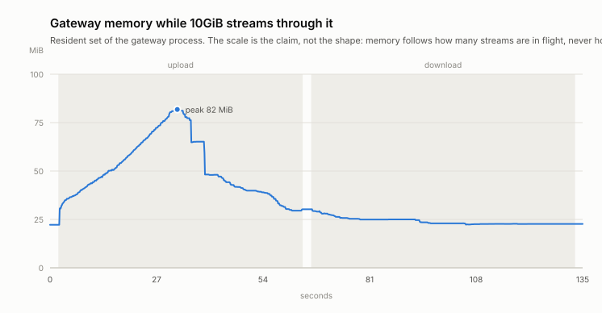

# blindbucket

**A transparent S3 encryption gateway, written in Go.**
Clients speak ordinary S3. The storage provider only ever sees ciphertext — never plaintext, never keys.

[](https://github.com/LennardGeissler/blindbucket/actions/workflows/ci.yml)
[](LICENSE)

> **Status: M3 done — standard S3 clients work, below the multipart threshold.**
> AWS CLI, boto3, `mc` and rclone all round-trip through the gateway. Client
> requests are authenticated with SigV4; ranges, listings and checksums work.
> Multipart uploads arrive with M4, so `aws s3 cp` of a file over 8 MiB still
> fails — cleanly. See [Roadmap](#roadmap) and
> [docs/COMPATIBILITY.md](docs/COMPATIBILITY.md).

---

## What it is

blindbucket is a reverse proxy that speaks the S3 API. It sits between any S3 client — AWS
CLI, boto3, rclone, `mc`, your own backend — and any S3-compatible store (AWS S3,
Cloudflare R2, MinIO, Backblaze B2). Uploads are encrypted in the stream, downloads are
decrypted in the stream. For the client, only the endpoint changes:

```
aws s3 cp big.tar.zst s3://backups/ --endpoint-url http://localhost:9000
```

The interesting part is not "AES around S3". It is what breaks when you try: authenticated
encryption for objects up to 5 TiB at constant memory, range requests over ciphertext,
parallel multipart uploads across several stateless instances, SigV4 in both directions, and
the checksum machinery of modern SDKs. Solving those cleanly is the substance of this
project.

| Property | How |
|---|---|
| Confidentiality | AES-256-GCM, a fresh data key per object |
| Integrity | Authenticated per chunk; tampering, truncation, reordering and swapping are detected |
| Constant memory | `O(chunk size)` per active stream, independent of object size |
| Statelessness | No local state; multipart state travels in an encrypted token |
| Drop-in compatibility | Standard clients unchanged, only `--endpoint-url` |
| Key rotation | KEK rotation by server-side copy; 1000 objects move 1.4 MiB, not 62.5 MiB |

## Why not just use…

| Approach | Why it is not enough |
|---|---|
| SSE-S3 / SSE-KMS | The provider holds the keys and sees plaintext |
| SSE-C | Key and plaintext go to the provider on every request |
| AWS S3 Encryption Client | Must be built into every application; language-bound; no CLI support |
| rclone crypt | Built for single-user sync, not a stateless multi-instance gateway |

A gateway centralises encryption at one point inside your own trust boundary. Applications
stay unchanged, and the security level does not depend on every team configuring a library
correctly.

## Security posture

The trust boundary is the proxy. Between client and proxy, data is plaintext — so the proxy
must run in the same trust domain as its clients (sidecar, or behind TLS on an internal
network). Anyone who controls the proxy host or the KEK has everything.

Metadata is **not** hidden: object names, exact sizes, timestamps and access patterns remain
visible to the provider. Rollback to an older genuine version of an object is not currently
detectable.

These are stated up front on purpose. The full analysis, including every residual risk, is
in **[docs/THREAT_MODEL.md](docs/THREAT_MODEL.md)**.

## Try it today

```sh
docker compose up -d                         # MinIO on :9002, as a stand-in provider
make build

export BLINDBUCKET_PASSPHRASE='...'          # or --passphrase-file, or you are prompted
./bin/blindbucket keygen --out keyring.json --kid 2026-09

cp blindbucket.example.yaml blindbucket.yaml
export UPSTREAM_ACCESS_KEY_ID=minioadmin UPSTREAM_SECRET_ACCESS_KEY=minioadmin
./bin/blindbucket serve --config blindbucket.yaml
```

Then point any S3 client at it. Nothing about the client changes except the
endpoint:

```sh
export AWS_ENDPOINT_URL=http://127.0.0.1:9000
aws s3 cp big.tar.zst s3://blindbucket-dev/
aws s3 ls s3://blindbucket-dev/
aws s3 sync ./backups s3://blindbucket-dev/backups/
```

`HEAD` reports the plaintext size, while the provider is holding something else
entirely:

```
$ curl -sI http://127.0.0.1:9000/blindbucket-dev/big.tar.zst | grep -i content-length
Content-Length: 3000000

$ mc stat local/blindbucket-dev/big.tar.zst
Size: 3000768                                # 32 + 3000000 + 16 x 46, exactly
X-Amz-Meta-Bb-Kid: 2026-09
X-Amz-Meta-Bb-Dek: SV7GTp0qCaXps-fpNUvKpsAOltVyKIHHscz6Dpmx14_i...

$ mc cat local/blindbucket-dev/big.tar.zst | head -c 16 | xxd
00000000: 424c 424b 0110 0000 0000 0000 ecd4 7291  BLBK..........r.
```

Change one bit of the stored object and the download stops at that chunk rather
than handing over a plausible-looking file.

Anything over 8 MiB goes through multipart, which every S3 client does on its own.
Each part is its own segment with its own salt, and a signed manifest binds them
into one object so that a provider cannot serve a short one:

```sh
aws s3 cp 5GiB.bin s3://blindbucket-dev/     # 640 parts, in parallel
aws s3 ls s3://blindbucket-dev/5GiB.bin      # 5368709120 — the plaintext size
```

The gateway keeps no state for any of it: the upload id a client gets back is a
sealed token carrying the data key and the manifest id, so parts can be spread
across instances and an instance can restart mid-upload. Orphaned manifests — from
a crashed upload, or from a plain PUT over a multipart object — are cleaned up out
of band:

```sh
./bin/blindbucket gc --config blindbucket.yaml --dry-run s3://blindbucket-dev
```

Retiring a key-encryption key does not mean re-encrypting anything. Each object
keeps its data key; only the key that wraps it changes, so the ciphertext never
leaves the provider:

```sh
./bin/blindbucket keygen --keyring keyring.json --kid 2026-10   # add the new KEK
./bin/blindbucket rotate --config blindbucket.yaml --to-kid 2026-10 s3://blindbucket-dev
```

A thousand 64 KiB objects rotate in about a second and a half, moving 1.4 MiB
over the wire for 62.5 MiB of payload — and that per-object cost does not grow
with object size. Clients may keep writing throughout: the rotation's final write
is conditional on the ETag it started from, so a client write that lands in
between wins and the object is skipped until the next run.

### Without a server

The crypto core is also usable on its own, which is the point of having shipped it
first: the format can be reviewed, fuzzed and measured before any HTTP is involved.

```sh
./bin/blindbucket encrypt --keyring keyring.json -i big.tar.zst -o big.tar.zst.bb
./bin/blindbucket decrypt --keyring keyring.json -i big.tar.zst.bb -o restored.tar.zst
```

## Numbers

Measured on an Apple M4 (10 cores, 16 GiB) with Go 1.27.1, against MinIO in a
local VM — client, gateway and provider all on the one laptop, competing for the
same cores and the same disk. Absolute figures would be higher on real hardware;
the comparisons are what the setup is built to measure. Reproduce with
`make bench` and [bench/warp.sh](bench/warp.sh); the scripts and the caveats are
in [bench/](bench/).

| Measurement | Result |
|---|---|
| Encrypt, 64 KiB chunks | 7.2 GB/s |
| Decrypt, 64 KiB chunks | 7.0 GB/s |
| Allocations per chunk, steady state | **0** |
| Allocations per 8 MiB stream | 22 encrypting, 26 decrypting — constant, not per chunk |
| 10 GiB encrypt + decrypt | identical SHA-256, **0.5 MiB peak Go heap** |
| 5 GiB through the gateway, one stream | identical SHA-256, **12 MiB resident** while streaming |
| 5 GiB multipart, 640 parts, two instances | identical SHA-256, **56 MiB peak resident** per instance |
| 10 GiB through the gateway, 10 parts in flight | identical SHA-256, **82 MiB peak resident**, 23 MiB idle |
| 10 MiB objects through the gateway vs direct | 92–97 % of the provider's own throughput |
| 1 KiB objects through the gateway vs direct | 70 % at one client, 89–92 % at 64 — about +0.5 ms per request |

## Clients

Measured by pointing each client at the gateway and running it, not by reading a
specification. Full detail and the exact commands are in
[docs/COMPATIBILITY.md](docs/COMPATIBILITY.md).

| Client | Status | Needs |
|---|---|---|
| AWS CLI v2 | works — `cp`, `ls`, `rm`, `sync`, ranges, multipart | nothing |
| boto3 | works — including paginators, delimiters and `upload_file` | nothing |
| MinIO `mc` | works — `cp`, `ls`, `mirror`, `cat` | nothing |
| rclone | works | `--ignore-checksum`, and `allow_unsigned_payload` on the proxy |

One call is deliberately not implemented: `ListMultipartUploads` returns 501. The
upload ids this gateway issues are sealed tokens carrying the data key and the
manifest id, and neither can be recovered from the provider's own listing — so the
honest answer is a refusal rather than a list of ids no client could use.

Two of those needed a fix that only a real client could have found: `mc` sends an
aws-chunked body with no trailer section at all, and rclone attaches an `?x-id=`
parameter that the router was refusing as an unknown sub-resource. boto3 found a
third — user metadata was arriving with Go's canonical header casing, so
`response["Metadata"]["origin"]` came back as `"Origin"` and every lookup missed.

The allocation figures are the interesting ones. They do not change with the
number of chunks, which is the whole of goal G3: memory is a function of how many
streams are in flight, never of how large they are.

<picture>
  <source media="(prefers-color-scheme: dark)" srcset="bench/figures/memory-dark.svg">
  
</picture>

Read that figure with two caveats. The upload is `aws s3 cp`, which splits 10 GiB
into 1280 parts and keeps ten in flight, so the peak covers ten concurrent
streams and not one. And on macOS the resident set does not fall when Go releases
pages, which makes every number on that curve an upper bound — the download half
is flat at 23 MiB because it never had to rise, not because the upload's memory
was reclaimed. The portable per-stream evidence is the Go-heap measurement in the
table above, which watches the heap rather than asking the operating system.

AES-GCM was expected to run well ahead of any network the proxy sits behind, so
the bottleneck should be the upstream and not the cipher. `warp` now says so
rather than the expectation standing on its own: against MinIO on the same
machine, 10 MiB objects move at 92–97 % of what the provider manages without the
gateway in the way.

<picture>
  <source media="(prefers-color-scheme: dark)" srcset="bench/figures/throughput-dark.svg">
  
</picture>

Small objects are where a proxy costs something, and it costs about half a
millisecond per request: 1 KiB uploads run at 70 % of direct with a single
client, rising to 89 % at 64 as that fixed cost amortises across concurrency. At
64 clients the p99 is identical to the provider's own, because by then the tail
belongs to the provider rather than to the gateway.

**One cell does not fit that picture**, and it is left standing rather than
dropped: 10 MiB PUTs at 64 concurrent clients run at 18 % of direct. It
reproduces across all three repetitions, it is specific to PUT — GET at the same
load is at 95 % — and the gateway process is idle while it happens, so it is
waiting on something rather than working. The cause is not identified yet.
[bench/figures/results.md](bench/figures/results.md) has the full table, the
hypothesis that did not survive its own repeat measurement, and what would settle
it.

One honest asterisk: the CLI's peak resident memory is about 70 MiB, essentially
all of it the 64 MiB Argon2id arena used once to unlock the keyring. That is a
deliberate trade — memory hardness is the point of Argon2id — and it is why the
constant-memory claim is measured on the Go heap rather than inferred from RSS.
[ADR-002](docs/adr/ADR-002-key-hierarchy.md) records the reasoning.

## Documentation

| Document | What it is |
|---|---|
| [docs/FORMAT.md](docs/FORMAT.md) | Normative wire format. An independent implementation should be able to interoperate from this document alone. |
| [docs/THREAT_MODEL.md](docs/THREAT_MODEL.md) | What is protected, what is not, and what the residual risks are. |
| [docs/COMPATIBILITY.md](docs/COMPATIBILITY.md) | Which clients work, which settings they need, and what does not work yet. Measured, not assumed. |
| [docs/adr/](docs/adr/) | Architecture decisions, with the alternatives that were rejected and why. |
| [testdata/vectors/](testdata/vectors/) | Known-answer vectors, normative alongside the format spec. |
| [ref/python/](ref/python/) | A second decoder written from the format spec alone, and the differential test that compares it against the Go one. |
| [spec/tla/](spec/tla/) | The formal model of the manifest coordination, its five TLC configurations, and the counterexamples written out. |
| [CONCEPT.md](CONCEPT.md) | The full design document the project is being built from (German). |

## Roadmap

| Milestone | Scope | Status |
|---|---|---|
| M0 | Repo, CI, format specification, threat model, ADR-001/002/011 | **done** |
| M1 | Crypto core (segment encoder/decoder), file keyring, `keygen`/`encrypt`/`decrypt` | **done** |
| M2 | Local proxy: `PutObject`, `GetObject`, `HeadObject`, `DeleteObject` | **done** |
| M3 | S3 compatibility: SigV4 verification, checksums, ranges, listings | **done** |
| M3.5 | TLA+ model of the manifest and rotation coordination, checked with TLC | **done** |
| M4 | Multipart uploads: upload token, manifest, `gc`, multi-instance operation | **done** |
| — | Independent Python reference decoder, differential fuzzing | **done** |
| M5 | Production: KMS/Vault providers, `CopyObject`, metrics | planned |
| — | `blindbucket rotate`: KEK rotation with conditional writes | **done** |
| — | Benchmarks: micro, memory, `warp` macro comparison, figures | **done** |
| M6 | Stretch: name encryption, presigned URLs, rollback protection | open |

M4 is the point the project becomes worth showing: multipart is what "works with real S3
clients" actually means for anything over 8 MiB. M3.5 existed to get its coordination rules
right before the code did — see below.

## A race in my own design, and the machine that found it

Version 0.2 of the concept found two race conditions in version 0.1's manifest lifecycle.
Both end the same way: a multipart object that is visible but has no manifest. The data is
still there and still decryptable, but the proxy refuses to serve an object it cannot verify
as whole, so every `GetObject` fails. Neither bug lives in a single request — both need two
requests interleaved a particular way, on two instances that never learn of each other.

The fix was four rules, derived by reasoning. So was the bug. Before M4 turns those rules
into Go, [`spec/tla/Multipart.tla`](spec/tla/Multipart.tla) turns them into a model that TLC
checks exhaustively: three concurrent uploads, a single-part PUT, a delete, a rotation and a
`gc` pass on one key, with a crash possible after every step. 38.5 million distinct states,
no counterexample.

Four more configurations put flawed rules back and *require* a counterexample — a model that
cannot find the bugs already known is not evidence about the ones that are not. Here is the
original `gc` bug, from the trace TLC produces, with the incidental steps of uninvolved
processes left out:

```
1  client  PutObject                              a single-part object is visible
2  u1      CreateMultipartUpload, HEAD            upload open; current manifest id: none
3  u1      write manifest u1                      manifests: {u1}
4  gc      list manifests                         listed: {u1}
5  gc      HEAD — the object is single-part       current: none
6  gc      delete listed manifests that are not   manifests: {}   ← u1 is gone
           the current one
7  u1      CompleteMultipartUpload                visible: multipart u1, manifest missing
```

Every fact `gc` observed was true. `u1` really was not the current manifest id at step 5 — it
just was not current *yet*.

The result that paid for the milestone was not one of the two known bugs. Rule R4 fixes an
order for two `gc` steps that both only *read*, and swapping them is the kind of edit that
passes review precisely because neither changes anything. TLC produces an unreadable object in
twelve states: check for open uploads first, find none, then list, and the listing picks up a
manifest written after the check. Listing first is what gives the check its meaning.

That configuration is now a regression test. Each counterexample is also written out as a
scenario for M4's integration tests — [spec/tla/README.md](spec/tla/README.md) has all four,
and [ADR-010](docs/adr/ADR-010-manifest-lifecycle-under-concurrency.md) records what the model
does and does not cover.

```sh
make tla        # all five configurations; four must fail, one must not
```

## Development

Requires Go 1.24 or newer (for `crypto/hkdf`) and Docker for the integration tests.

```sh
make build          # build ./bin/blindbucket
make test           # go test -race
make lint           # golangci-lint
make fuzz           # 30s per fuzz target
make bench          # micro-benchmarks
make vuln           # govulncheck
make tla            # model-check spec/tla (needs a JRE; downloads tla2tools.jar)

docker compose up -d   # local MinIO on :9002, console on :9091
```

The integration tests need a provider and skip without one:

```sh
docker compose up -d
BLINDBUCKET_TEST_S3_ENDPOINT=http://localhost:9002 go test ./internal/upstream ./internal/proxy

# and against a running gateway, with a real client:
python3 test/integration/clients/boto3/scenarios.py
```

Production code is Go, without exception. Anything else in this repository — the Python
client tests, the TLA+ model — has a written reason in
[ADR-011](docs/adr/ADR-011-languages-outside-the-go-core.md).

## Reviews welcome

The format was specified before it was implemented precisely so that it can be reviewed,
and [testdata/vectors/segment_v1.json](testdata/vectors/segment_v1.json) fixes every input
so an independent implementation can check itself against it.

That is no longer only an invitation: [ref/python/](ref/python/) is a second decoder
written from the specification, and it agrees with the Go one on every vector and on
100 000 mutated inputs. Writing it turned up one ambiguity — the final-chunk rule is
stated for a streaming decoder, and the natural length comparison for a buffered one can
be read two ways, of which the wrong one is correct for every object whose size is not an
exact multiple of the chunk size. That is now spelled out in the format spec.

Every guarantee is backed by tests that play an actively hostile storage provider and
require an error rather than plaintext: every single-bit flip across all 32 header bytes,
tampered chunk data and tags, swapped and duplicated chunks, truncation at and inside chunk
boundaries, appended bytes, forged chunk sizes, and multipart segments served under the
wrong part number. A fuzz target additionally requires that anything the decoder accepts
re-encrypts to the identical bytes, which rules out two ciphertexts decoding to one
plaintext.

The same applies end to end. Integration tests against a real MinIO rewrite stored objects
behind the gateway's back — corrupting a chunk, truncating the ciphertext, swapping two
objects' bodies, forging a wrapped key — and require an error rather than plaintext in
every case.

If you find a weakness in [docs/FORMAT.md](docs/FORMAT.md), in the reasoning in
[docs/THREAT_MODEL.md](docs/THREAT_MODEL.md), or an attack the tests miss, please open an
issue — that is the most valuable contribution this project can receive.

## License

Apache License 2.0 — see [LICENSE](LICENSE).
